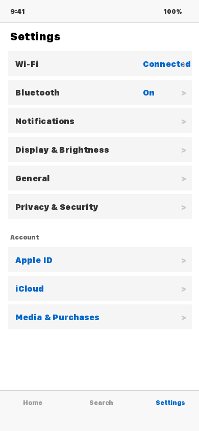
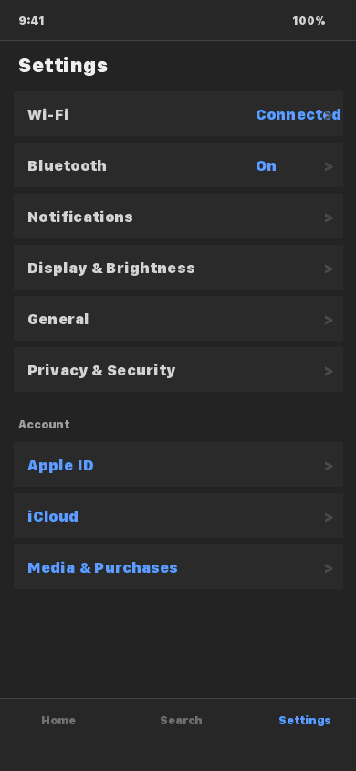
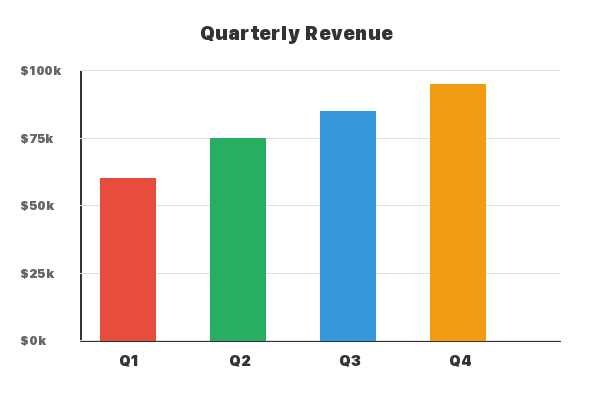
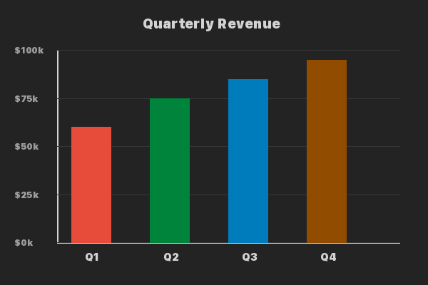

# Adaptive Image Format (AIF)

[](https://github.com/MKsys1337/AIF/actions/workflows/ci-python.yml)
[](https://github.com/MKsys1337/AIF/actions/workflows/ci-js.yml)
[](https://github.com/MKsys1337/AIF/actions/workflows/ci-swift.yml)
[](LICENSE)
[](spec/AIF-Technische-Spezifikation-v1.0.md)

**Automatically adapt user-uploaded images to dark/light mode on social media platforms.**

AIF is a specification and reference implementation for a transparent server-side pipeline that classifies uploaded images (screenshot, photo, diagram, etc.), generates theme-adaptation metadata, and embeds it into the image file. Clients then render the appropriate variant based on the active color scheme — with zero user effort.

```
User uploads        Server classifies       Client renders
  screenshot    →    + generates CLUT    →    dark variant
   (light)           + embeds XMP             automatically
```

## The Problem

Hundreds of millions of users browse social media in dark mode. Yet user-uploaded screenshots, charts, and UI captures are displayed unchanged — a bright white screenshot at 3 AM on minimum brightness is a measurable UX problem.

## The Solution

AIF solves this transparently:

- **Zero user effort** — no behavior change required
- **< 1 KB overhead** for CLUT-based screenshots
- **> 95% classification accuracy** (screenshot vs. photo)
- **100% backward compatible** — old clients see the original image

## Visual Comparison

| | Original (Light Mode) | Adapted (Dark Mode) |
|---|:-:|:-:|
| **Screenshot** |  |  |
| **Diagram** |  |  |
| **Photo** |  |  |

> Generated with `python scripts/generate_showcase.py` using the AIF pipeline.

## Architecture

```
┌──────────────────────────────────────────────────────┐
│  UPLOAD PIPELINE (Server)                            │
│  Ingest → Classify → Analyze → Generate → Embed     │
│  Package: aif-core (Python)                          │
└──────────────────────┬───────────────────────────────┘
                       ▼
┌──────────────────────────────────────────────────────┐
│  STORAGE / CDN                                       │
│  Image + AIF metadata (XMP / AVIF / HTTP headers)    │
└──────────────────────┬───────────────────────────────┘
                       ▼
┌──────────────────────────────────────────────────────┐
│  CLIENT RENDERING                                    │
│  Web: @aif/renderer    iOS/macOS: AIF (Swift)        │
│  CLUT Remap → Luminance Inversion → CSS Fallback     │
└──────────────────────────────────────────────────────┘
```

## Packages

| Package | Language | Description | Path |
|---------|----------|-------------|------|
| **aif-core** | Python | Server-side classification, color analysis, theme map generation, XMP embedding | [`packages/python`](packages/python) |
| **@aif/renderer** | TypeScript | Client-side renderer with CLUT remapping, luminance inversion, CSS fallbacks | [`packages/js`](packages/js) |
| **AIF** | Swift | iOS/macOS client with Core Image integration and UIImageView extension | [`packages/swift`](packages/swift) |

## Quick Start

### Server (Python)

```bash
cd packages/python
pip install -e ".[dev]"
```

```python
from aif import AIFPipeline

pipeline = AIFPipeline()

with open("screenshot.png", "rb") as f:
    processed, result = pipeline.process(f.read(), "png")

print(result.content_type)        # "screenshot"
print(result.transform_strategy)  # "clut"
```

### Web Client (TypeScript)

```bash
cd packages/js
npm install
```

```typescript
import { AIFRenderer, observeImages } from "@aif/renderer";

const renderer = new AIFRenderer();
observeImages(renderer); // Processes all current and future  elements
```

### iOS/macOS (Swift)

```swift
import AIF

let metadata = AIFMetadata(
    contentType: .screenshot,
    sourceScheme: .light,
    invertSafe: true,
    paletteMap: ["#FFFFFF": "#1A1A2E"],
    transformStrategy: .clut
)

imageView.setAIFImage(image, metadata: metadata)
```

## Specification

The full technical specification (v1.0-draft) is available at [`spec/AIF-Technische-Spezifikation-v1.0.md`](spec/AIF-Technische-Spezifikation-v1.0.md).

Key sections:
- **Section 4**: Upload pipeline (classification, color analysis, theme map generation)
- **Section 5**: Container format (AVIF extension, XMP schema)
- **Section 6**: Client rendering (web, iOS, fallback strategies)
- **Section 9**: API definitions (OpenAPI 3.1)

## Documentation

- [Architecture Overview](docs/architecture.md)
- [Getting Started](docs/getting-started.md)
- [Dual Licensing](docs/dual-licensing.md)
- [API Specification](api/openapi.yaml)

## Roadmap

| Phase | Milestone |
|-------|-----------|
| **1 — CSS Filters + XMP** | Server pipeline classifies uploads, embeds XMP metadata; clients apply CSS filter fallbacks. *Current phase.* |
| **2 — CLUT Remapping** | Pixel-accurate color remapping via Canvas 2D (web), Core Image (iOS/macOS), and Vulkan compute (Android). |
| **3 — Native AVIF Theme Map** | AVIF container extension (`thmb` box, auxiliary image item `urn:aif:theme-map:v1`, `aifA` compatible brand). Browser standardization via WICG proposal and AOM AVIF extension draft. IETF media type registration. |
| **4 — Ecosystem Integration** | Platform adoption, native browser `` support for theme-aware rendering, `Sec-CH-Prefers-Color-Scheme` content negotiation at CDN level. |

## Contributing

See [CONTRIBUTING.md](CONTRIBUTING.md) for guidelines.

## License

Copyright (C) 2026 Markus Köplin

This project is licensed under the **GNU Affero General Public License v3.0 or later** (AGPL-3.0-or-later). See [LICENSE](LICENSE) for the full text.

### Commercial License

A commercial license is available for organizations that cannot comply with the AGPL. See [LICENSE-COMMERCIAL.md](LICENSE-COMMERCIAL.md) for details.
