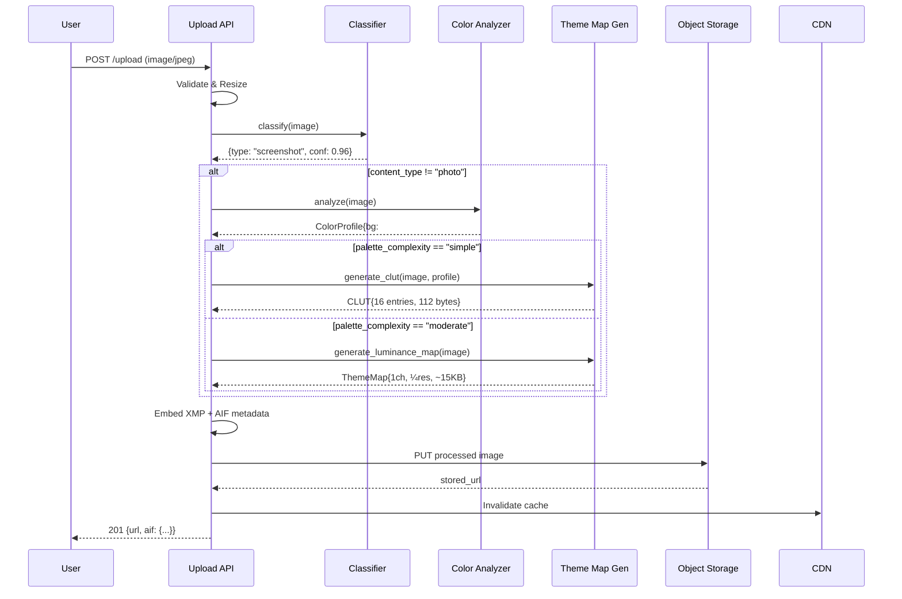
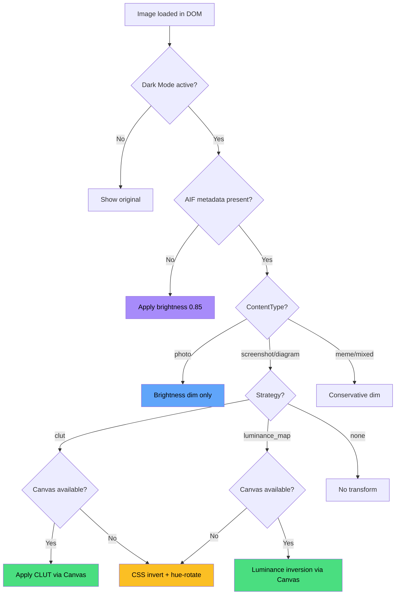
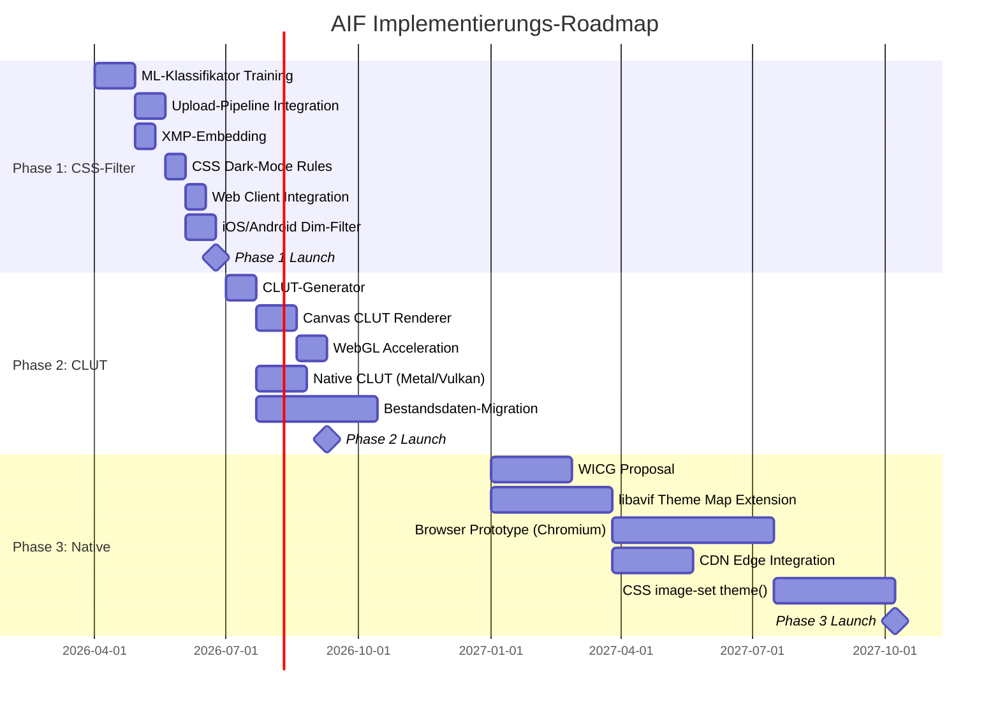

# Adaptive Image Format (AIF) – Technische Spezifikation v1.0

**Konzeptionspapier für Plattformbetreiber**
**Status:** Draft Specification
**Datum:** März 2026
**Zielgruppe:** Platform Engineering Teams (X/Twitter, Reddit, Discord, Mastodon, Meta, etc.)

---

## Inhaltsverzeichnis

1. [Executive Summary](#1-executive-summary)
2. [Problemdefinition](#2-problemdefinition)
3. [Architekturübersicht](#3-architekturübersicht)
4. [Upload-Pipeline-Spezifikation](#4-upload-pipeline-spezifikation)
   - 4.1 [Bildklassifikation (ML-Modul)](#41-bildklassifikation-ml-modul)
   - 4.2 [Farbanalyse-Modul](#42-farbanalyse-modul)
   - 4.3 [Theme-Map-Generator](#43-theme-map-generator)
   - 4.4 [CLUT-Generator](#44-clut-generator)
5. [Container-Format-Spezifikation](#5-container-format-spezifikation)
   - 5.1 [AVIF/HEIF Theme Map Extension](#51-avifheif-theme-map-extension)
   - 5.2 [Theme Metadata Box (`thmb`)](#52-theme-metadata-box-thmb)
   - 5.3 [XMP-Metadaten-Schema](#53-xmp-metadaten-schema)
6. [Client-Rendering-Spezifikation](#6-client-rendering-spezifikation)
   - 6.1 [Web-Client (Browser/PWA)](#61-web-client-browserpwa)
   - 6.2 [Native iOS/Android](#62-native-iosandroid)
   - 6.3 [Fallback-Strategien](#63-fallback-strategien)
7. [HTTP-Content-Negotiation](#7-http-content-negotiation)
8. [CSS-Integration](#8-css-integration)
9. [API-Definitionen](#9-api-definitionen)
   - 9.1 [Upload API](#91-upload-api)
   - 9.2 [Image Delivery API](#92-image-delivery-api)
   - 9.3 [Classification API (intern)](#93-classification-api-intern)
10. [Referenz-Implementierungen](#10-referenz-implementierungen)
    - 10.1 [Server: Python Upload Pipeline](#101-server-python-upload-pipeline)
    - 10.2 [Server: Go Image Processing Service](#102-server-go-image-processing-service)
    - 10.3 [Client: JavaScript Renderer](#103-client-javascript-renderer)
    - 10.4 [Client: Swift/iOS Renderer](#104-client-swiftios-renderer)
11. [Bandbreiten- und Performance-Analyse](#11-bandbreiten--und-performance-analyse)
12. [Migrationsstrategie für Bestandsdaten](#12-migrationsstrategie-für-bestandsdaten)
13. [Implementierungsphasen](#13-implementierungsphasen)
14. [Sicherheit und Privacy](#14-sicherheit-und-privacy)
15. [Anhang: Mermaid-Diagramme](#15-anhang-mermaid-diagramme)

---

## 1. Executive Summary

Hunderte Millionen Nutzer verwenden Dark Mode auf Social-Media-Plattformen. Dennoch werden nutzerhochgeladene Bilder – insbesondere Screenshots, Statistiken und UI-Captures – unverändert angezeigt. Ein heller Screenshot um 3 Uhr morgens bei niedrigster Displayhelligkeit ist nicht nur unangenehm, sondern ein messbares UX-Defizit.

**Adaptive Image Format (AIF)** löst dieses Problem durch eine transparente serverseitige Pipeline, die bestehende Bilduploads (JPG, PNG, WebP) automatisch um Theme-Adaptions-Metadaten erweitert. Der Nutzer ändert nichts an seinem Verhalten. Die Plattform klassifiziert, transformiert und liefert – der Client rendert kontextabhängig.

**Kernmetriken des Vorschlags:**

| Metrik | Wert |
|--------|------|
| User-seitiger Aufwand | **Null** – keine Verhaltensänderung |
| Bandbreiten-Overhead (Screenshots) | **0,1–15%** vs. 100% bei Dual-File |
| Klassifikationsgenauigkeit (Screenshot vs. Foto) | **>95%** |
| Rückwärtskompatibilität | **100%** – alte Clients sehen Originalbild |
| Phase-1 Implementierungszeit | **4–8 Wochen** (XMP + CSS-Filter) |

---

## 2. Problemdefinition

### 2.1 Das Blendungsproblem

```
┌─────────────────────────────────────────────────────────────┐
│  User-Szenario                                              │
│                                                             │
│  ┌───────────┐    scrollt im     ┌───────────────────────┐  │
│  │  Nutzer    │ ──────────────▶  │  Feed (Dark Mode)     │  │
│  │  nachts,   │    Dark Mode     │                       │  │
│  │  niedrige  │                  │  ████████████████████  │  │
│  │  Helligkeit│                  │  ██  Dark Post     ██  │  │
│  └───────────┘                   │  ████████████████████  │  │
│                                  │                       │  │
│       😣                         │  ┌─────────────────┐  │  │
│    BLENDUNG ◀────────────────── │  │ ░░░░░░░░░░░░░░░ │  │  │
│                                  │  │ ░  HELLER      ░ │  │  │
│                                  │  │ ░  SCREENSHOT   ░ │  │  │
│                                  │  │ ░  #FFFFFF BG   ░ │  │  │
│                                  │  │ ░░░░░░░░░░░░░░░ │  │  │
│                                  │  └─────────────────┘  │  │
│                                  │                       │  │
│                                  │  ████████████████████  │  │
│                                  │  ██  Dark Post     ██  │  │
│                                  │  ████████████████████  │  │
│                                  └───────────────────────┘  │
└─────────────────────────────────────────────────────────────┘
```

### 2.2 Betroffene Bildtypen

| Bildtyp | Anteil am Upload-Volumen* | Transformierbar? | Methode |
|---------|---------------------------|------------------|---------|
| Screenshots (UI) | ~35% | ✅ Ja | CLUT / Theme Map |
| Diagramme/Charts | ~10% | ✅ Ja | CLUT / Theme Map |
| Text-Posts (andere Plattform) | ~15% | ✅ Ja | CLUT / Theme Map |
| Memes (Text + Bild) | ~15% | ⚠️ Teilweise | Theme Map (selektiv) |
| Fotos | ~20% | ❌ Nein | Nur Brightness-Dimming |
| Sonstige | ~5% | ⚠️ Fallabhängig | Heuristik |

*Geschätzte Verteilung für text-lastige Plattformen wie X/Twitter

### 2.3 Warum kein existierender Standard reicht

| Ansatz | Problem |
|--------|---------|
| `<picture>` + `prefers-color-scheme` | Erfordert 2 Dateien, reagiert nur auf OS-Präferenz, nicht App-Theme |
| SVG mit Media Queries | Nur Vektorgrafiken, Browser-Bugs (Chromium, Safari) |
| CSS `filter: invert(1)` | Zerstört Fotos, verschiebt Farbtöne, kein selektives Anwenden |
| Dark Reader (Extension) | Nicht plattform-nativ, manuell pro Site, keine Bild-Transformation |
| Apple Asset Catalogs | Nur für App-Entwickler, nicht für UGC (User Generated Content) |

---

## 3. Architekturübersicht

### 3.1 System-Architektur (Gesamtbild)

```
┌─────────────────────────────────────────────────────────────────────────┐
│                        AIF SYSTEM ARCHITECTURE                         │
│                                                                         │
│  ┌──────────┐     ┌──────────────────────────────────────────────────┐  │
│  │          │     │          UPLOAD PIPELINE (Server)                │  │
│  │  USER    │     │                                                  │  │
│  │  lädt    │────▶│  ┌──────┐  ┌──────────┐  ┌───────┐  ┌───────┐  │  │
│  │  JPG/PNG │     │  │Ingest│─▶│Classifier│─▶│Color  │─▶│Theme  │  │  │
│  │  hoch    │     │  │      │  │(ML)      │  │Analyze│  │Map Gen│  │  │
│  │          │     │  └──────┘  └──────────┘  └───────┘  └───┬───┘  │  │
│  └──────────┘     │                                         │      │  │
│                   │                              ┌──────────▼───┐  │  │
│                   │                              │  AIF-AVIF    │  │  │
│                   │                              │  + XMP Meta  │  │  │
│                   │                              │  + Theme Map │  │  │
│                   │                              └──────┬───────┘  │  │
│                   └─────────────────────────────────────┼──────────┘  │
│                                                         │             │
│                   ┌─────────────────────────────────────┼──────────┐  │
│                   │          STORAGE / CDN              │          │  │
│                   │                                     ▼          │  │
│                   │  ┌─────────────────────────────────────────┐   │  │
│                   │  │  Object Storage (S3/GCS/R2)            │   │  │
│                   │  │  ├── /original/    (Quellbild)         │   │  │
│                   │  │  ├── /processed/   (AIF-AVIF)          │   │  │
│                   │  │  └── /meta/        (Klassifikation)    │   │  │
│                   │  └─────────────────────────────────────────┘   │  │
│                   └─────────────────────────────────────┬──────────┘  │
│                                                         │             │
│                   ┌─────────────────────────────────────┼──────────┐  │
│                   │          DELIVERY (CDN Edge)        │          │  │
│                   │                                     ▼          │  │
│                   │  ┌─────────┐  Sec-CH-Color-Scheme  ┌───────┐  │  │
│                   │  │  Edge   │◀─────────────────────▶│Client │  │  │
│                   │  │  Worker │  Accept: theme=dark    │(App/  │  │  │
│                   │  │         │─────────────────────▶ │Web)   │  │  │
│                   │  └─────────┘  image/avif+aif       └───────┘  │  │
│                   └────────────────────────────────────────────────┘  │
│                                                                       │
│  ┌──────────┐     ┌──────────────────────────────────────────────────┐│
│  │          │     │          CLIENT RENDERING                        ││
│  │  USER    │     │                                                  ││
│  │  sieht   │◀───│  Dark Mode aktiv?                                ││
│  │  adaptier-│    │    ├─ JA  → AIF-Metadaten vorhanden?            ││
│  │  tes Bild │    │    │        ├─ JA  → ContentType=photo?         ││
│  │          │     │    │        │    ├─ JA  → Brightness-Dim only   ││
│  │          │     │    │        │    └─ NEIN → Apply Theme Map/CLUT ││
│  │          │     │    │        └─ NEIN → Universeller Dim-Filter   ││
│  │          │     │    └─ NEIN → Originalbild anzeigen              ││
│  └──────────┘     └──────────────────────────────────────────────────┘│
└─────────────────────────────────────────────────────────────────────────┘
```

### 3.2 Datenfluss-Diagramm

```
User Upload                Server Pipeline              Storage           Client
    │                           │                          │                 │
    │   POST /upload            │                          │                 │
    │   (image/jpeg)            │                          │                 │
    │──────────────────────────▶│                          │                 │
    │                           │                          │                 │
    │                     ┌─────┴──────┐                   │                 │
    │                     │ 1. Decode  │                   │                 │
    │                     │    Image   │                   │                 │
    │                     └─────┬──────┘                   │                 │
    │                           │                          │                 │
    │                     ┌─────┴──────┐                   │                 │
    │                     │ 2. Classify│                   │                 │
    │                     │ screenshot │                   │                 │
    │                     │ vs. photo  │                   │                 │
    │                     └─────┬──────┘                   │                 │
    │                           │                          │                 │
    │                     ┌─────┴──────┐                   │                 │
    │                     │ 3. Extract │                   │                 │
    │                     │ Color      │                   │                 │
    │                     │ Palette    │                   │                 │
    │                     └─────┬──────┘                   │                 │
    │                           │                          │                 │
    │                     ┌─────┴──────┐                   │                 │
    │                     │ 4. Generate│                   │                 │
    │                     │ Theme Map  │                   │                 │
    │                     │ or CLUT    │                   │                 │
    │                     └─────┬──────┘                   │                 │
    │                           │                          │                 │
    │                     ┌─────┴──────┐                   │                 │
    │                     │ 5. Encode  │                   │                 │
    │                     │ AIF-AVIF   │                   │                 │
    │                     │ + XMP Meta │                   │                 │
    │                     └─────┬──────┘                   │                 │
    │                           │                          │                 │
    │                           │   PUT object             │                 │
    │                           │─────────────────────────▶│                 │
    │                           │                          │                 │
    │   201 Created             │                          │                 │
    │   {image_id, aif: true}   │                          │                 │
    │◀──────────────────────────│                          │                 │
    │                           │                          │                 │
    │                           │                          │   GET /img/{id} │
    │                           │                          │◀────────────────│
    │                           │                          │   Accept: ...   │
    │                           │                          │   theme=dark    │
    │                           │                          │                 │
    │                           │                          │   200 OK        │
    │                           │                          │   AIF-AVIF      │
    │                           │                          │────────────────▶│
    │                           │                          │                 │
    │                           │                          │           ┌─────┴─────┐
    │                           │                          │           │ Render w/ │
    │                           │                          │           │ Theme Map │
    │                           │                          │           └───────────┘
```

---

## 4. Upload-Pipeline-Spezifikation

### 4.1 Bildklassifikation (ML-Modul)

#### 4.1.1 Klassifikations-Taxonomie

```
ContentType Enum:
  PHOTO          = 0x01    # Kamera-Foto, kein Transformations-Kandidat
  SCREENSHOT     = 0x02    # UI-Screenshot, primärer Kandidat
  DIAGRAM        = 0x03    # Charts, Graphen, Infografiken
  TEXT_POST      = 0x04    # Screenshot eines Posts anderer Plattform
  MEME           = 0x05    # Text-Overlay auf Bild
  ICON           = 0x06    # Logo, Icon, Vektorgrafik-artig
  MIXED          = 0x07    # Gemischter Inhalt
  UNKNOWN        = 0xFF    # Nicht klassifizierbar
```

#### 4.1.2 Klassifikations-Heuristiken (Nicht-ML-Fallback)

Bevor ein ML-Modell eingesetzt wird, können einfache Heuristiken bereits ~85% Genauigkeit erreichen:

```python
class ImageClassifierHeuristic:
    """
    Regelbasierter Klassifikator als Fallback oder Pre-Filter.
    Reduziert ML-Inference-Last um ~60%.
    """

    # Schwellenwerte (empirisch kalibriert)
    SCREENSHOT_MAX_COLORS = 64          # Screenshots haben wenige Farben
    SCREENSHOT_MIN_EDGE_RATIO = 0.15    # Anteil scharfer Kanten
    PHOTO_MIN_COLORS = 10000            # Fotos haben viele Farben
    PHOTO_MAX_UNIFORM_AREA = 0.20       # Max. Anteil uniformer Flächen

    def classify(self, image: np.ndarray) -> tuple[ContentType, float]:
        """
        Gibt (ContentType, confidence) zurück.
        confidence < 0.7 → an ML-Modell weiterleiten.
        """
        height, width = image.shape[:2]
        total_pixels = height * width

        # 1. EXIF-Prüfung: Kamera-Metadaten → definitiv Foto
        if self._has_camera_exif(image):
            return (ContentType.PHOTO, 0.99)

        # 2. Farbzählung
        unique_colors = self._count_unique_colors(image, sample_size=50000)

        # 3. Uniformitätsanalyse (große einfarbige Flächen)
        uniform_ratio = self._uniform_area_ratio(image, tolerance=5)

        # 4. Kantenanalyse (scharfe UI-Kanten vs. weiche Foto-Übergänge)
        edge_ratio = self._edge_density(image)

        # 5. Aspect Ratio (typische Device-Auflösungen)
        is_device_ratio = self._is_device_aspect_ratio(width, height)

        # Entscheidungsbaum
        if unique_colors < self.SCREENSHOT_MAX_COLORS and uniform_ratio > 0.5:
            return (ContentType.SCREENSHOT, 0.92)

        if unique_colors > self.PHOTO_MIN_COLORS and edge_ratio < 0.05:
            return (ContentType.PHOTO, 0.88)

        if uniform_ratio > 0.6 and edge_ratio > self.SCREENSHOT_MIN_EDGE_RATIO:
            if is_device_ratio:
                return (ContentType.SCREENSHOT, 0.85)
            else:
                return (ContentType.DIAGRAM, 0.75)

        # Unsicher → ML-Modell muss entscheiden
        return (ContentType.UNKNOWN, 0.0)

    def _count_unique_colors(self, image: np.ndarray, sample_size: int) -> int:
        """Zählt distinkte Farben in einem Sample der Pixel."""
        flat = image.reshape(-1, 3)
        if len(flat) > sample_size:
            indices = np.random.choice(len(flat), sample_size, replace=False)
            flat = flat[indices]
        # Quantisierung auf 6-Bit pro Kanal (reduziert JPEG-Artefakte)
        quantized = (flat >> 2).astype(np.uint32)
        packed = (quantized[:, 0] << 16) | (quantized[:, 1] << 8) | quantized[:, 2]
        return len(np.unique(packed))

    def _uniform_area_ratio(self, image: np.ndarray, tolerance: int) -> float:
        """
        Berechnet den Anteil der Pixel, die zu großen uniformen Flächen gehören.
        Hoher Wert = Screenshot-typisch (große einfarbige Hintergründe).
        """
        gray = cv2.cvtColor(image, cv2.COLOR_BGR2GRAY)
        # Laplacian für lokale Varianz
        laplacian = cv2.Laplacian(gray, cv2.CV_64F)
        uniform_mask = np.abs(laplacian) < tolerance
        return np.sum(uniform_mask) / uniform_mask.size

    def _edge_density(self, image: np.ndarray) -> float:
        """Anteil der Kantenpixel (Canny) am Gesamtbild."""
        gray = cv2.cvtColor(image, cv2.COLOR_BGR2GRAY)
        edges = cv2.Canny(gray, 50, 150)
        return np.sum(edges > 0) / edges.size

    def _is_device_aspect_ratio(self, width: int, height: int) -> bool:
        """Prüft auf typische Device-Screenshots."""
        ratio = max(width, height) / min(width, height)
        # iPhone: 19.5:9 ≈ 2.17, Android: 20:9 ≈ 2.22, Desktop: 16:9 ≈ 1.78
        device_ratios = [2.17, 2.22, 2.0, 1.78, 1.6, 1.33]
        return any(abs(ratio - dr) < 0.1 for dr in device_ratios)

    def _has_camera_exif(self, image) -> bool:
        """Prüft ob EXIF-Daten auf eine Kamera hinweisen."""
        # Implementation über Pillow/exifread
        # Sucht nach: Make, Model, FocalLength, ExposureTime
        pass
```

#### 4.1.3 ML-Klassifikator (Primärsystem)

```python
"""
AIF Content Type Classifier
Architektur: MobileNetV3-Small (fine-tuned)
Eingabe: 224x224 RGB
Ausgabe: 8 Klassen (ContentType Enum)
Latenz: ~5ms auf T4 GPU, ~15ms auf CPU (ARM)
Modellgröße: ~4.2 MB (INT8 quantized)
"""

import torch
import torchvision.transforms as T
from torchvision.models import mobilenet_v3_small

class AIFClassifier:
    CLASSES = [
        'photo', 'screenshot', 'diagram', 'text_post',
        'meme', 'icon', 'mixed', 'unknown'
    ]

    TRANSFORM = T.Compose([
        T.Resize(256),
        T.CenterCrop(224),
        T.ToTensor(),
        T.Normalize(mean=[0.485, 0.456, 0.406],
                     std=[0.229, 0.224, 0.225]),
    ])

    def __init__(self, model_path: str):
        self.model = mobilenet_v3_small(num_classes=len(self.CLASSES))
        self.model.load_state_dict(torch.load(model_path, map_location='cpu'))
        self.model.eval()

    @torch.no_grad()
    def classify(self, pil_image) -> dict:
        """
        Returns:
            {
                "content_type": "screenshot",
                "confidence": 0.96,
                "invert_safe": True,
                "all_scores": {"photo": 0.02, "screenshot": 0.96, ...}
            }
        """
        tensor = self.TRANSFORM(pil_image).unsqueeze(0)
        logits = self.model(tensor)
        probs = torch.softmax(logits, dim=1)[0]

        top_idx = torch.argmax(probs).item()
        content_type = self.CLASSES[top_idx]
        confidence = probs[top_idx].item()

        # InvertSafe: Fotos und Memes sind NICHT sicher invertierbar
        invert_safe = content_type in ('screenshot', 'diagram', 'text_post', 'icon')

        return {
            "content_type": content_type,
            "confidence": confidence,
            "invert_safe": invert_safe,
            "all_scores": {c: probs[i].item() for i, c in enumerate(self.CLASSES)}
        }


# Trainings-Datensatz Anforderungen:
#
# Klasse          | Min. Samples | Quellen
# ----------------|-------------|------------------------------------------
# photo           | 50.000      | COCO, ImageNet, Flickr
# screenshot      | 50.000      | Rico Dataset, eigene Sammlung (diverse OS)
# diagram         | 20.000      | PlotQA, eigene Extraktion aus Papers
# text_post       | 30.000      | Synthetisch generiert + manuelle Sammlung
# meme            | 20.000      | Imgflip Dataset
# icon            | 15.000      | SVG-Icon-Sets, gerastert
# mixed           | 10.000      | Manuelle Annotation
# unknown         | 5.000       | Diverse schwer klassifizierbare Bilder
```

#### 4.1.4 Entscheidungsmatrix: Heuristik vs. ML

```
                    ┌─────────────────────┐
                    │   Bild hochgeladen   │
                    └──────────┬──────────┘
                               │
                    ┌──────────▼──────────┐
                    │  EXIF enthält        │
                    │  Kamera-Metadaten?   │
                    └──────┬────────┬─────┘
                       JA  │        │  NEIN
                           ▼        ▼
                    ┌──────────┐  ┌────────────────┐
                    │ → PHOTO  │  │  Heuristik-    │
                    │ conf=0.99│  │  Klassifikator │
                    └──────────┘  └───────┬────────┘
                                          │
                               ┌──────────▼──────────┐
                               │  confidence ≥ 0.80?  │
                               └──────┬────────┬─────┘
                                  JA  │        │  NEIN
                                      ▼        ▼
                               ┌──────────┐  ┌────────────┐
                               │ Ergebnis │  │ ML-Modell  │
                               │ verwenden│  │ (GPU/CPU)  │
                               └──────────┘  └─────┬──────┘
                                                    │
                                         ┌──────────▼──────────┐
                                         │  confidence ≥ 0.60?  │
                                         └──────┬────────┬─────┘
                                             JA  │        │  NEIN
                                                 ▼        ▼
                                          ┌──────────┐  ┌──────────┐
                                          │ Ergebnis │  │ → UNKNOWN│
                                          │ verwenden│  │ kein AIF │
                                          └──────────┘  └──────────┘
```

### 4.2 Farbanalyse-Modul

```python
import numpy as np
from dataclasses import dataclass, field
from collections import Counter
from sklearn.cluster import MiniBatchKMeans
from colormath.color_objects import sRGBColor, LabColor
from colormath.color_conversions import convert_color


@dataclass
class ColorProfile:
    """Ergebnis der Farbanalyse eines Bildes."""
    dominant_background: str          # Hex, z.B. "#FFFFFF"
    dominant_foreground: str          # Hex, z.B. "#333333"
    palette: list[str]               # Top-N Farben als Hex
    unique_color_count: int          # Anzahl distinkter Farben
    background_coverage: float       # 0.0-1.0, Anteil der Hintergrundfarbe
    is_light_background: bool        # True wenn L* > 70 im LAB-Raum
    luminance_histogram: list[int]   # 256 Bins, L*-Verteilung
    palette_complexity: str          # "simple" (<32), "moderate" (32-256), "complex" (>256)


class ColorAnalyzer:
    """
    Analysiert die Farbverteilung eines Bildes für die Theme-Map-Generierung.
    """

    def analyze(self, image: np.ndarray, max_palette_size: int = 16) -> ColorProfile:
        """
        Args:
            image: BGR numpy array (OpenCV Format)
            max_palette_size: Maximale Anzahl Paletten-Farben

        Returns:
            ColorProfile mit allen relevanten Farbinformationen
        """
        rgb = cv2.cvtColor(image, cv2.COLOR_BGR2RGB)
        height, width = rgb.shape[:2]

        # 1. Hintergrundfarbe ermitteln (Rand-Sampling)
        dominant_bg = self._detect_background(rgb)

        # 2. Farbpalette extrahieren (k-Means Clustering)
        palette = self._extract_palette(rgb, max_palette_size)

        # 3. Unique Color Count
        unique_count = self._count_unique_quantized(rgb)

        # 4. Background Coverage
        bg_coverage = self._calculate_background_coverage(rgb, dominant_bg)

        # 5. Luminanz-Analyse
        lab = cv2.cvtColor(rgb, cv2.COLOR_RGB2LAB)
        l_channel = lab[:, :, 0]  # L* Kanal (0-255 in OpenCV)
        luminance_hist = np.histogram(l_channel, bins=256, range=(0, 255))[0].tolist()

        # L* des Hintergrunds (skaliert: OpenCV L* = 0-255, CIE L* = 0-100)
        bg_rgb = np.array([[list(int(dominant_bg[i:i+2], 16) for i in (1, 3, 5))]], dtype=np.uint8)
        bg_lab = cv2.cvtColor(bg_rgb.reshape(1, 1, 3), cv2.COLOR_RGB2LAB)
        bg_lightness = bg_lab[0, 0, 0] * 100 / 255  # Normalisiert auf 0-100

        # 6. Palette Complexity
        if unique_count < 32:
            complexity = "simple"
        elif unique_count < 256:
            complexity = "moderate"
        else:
            complexity = "complex"

        # Dominante Vordergrundfarbe (häufigste Farbe, die NICHT Hintergrund ist)
        dominant_fg = self._detect_foreground(rgb, dominant_bg, palette)

        return ColorProfile(
            dominant_background=dominant_bg,
            dominant_foreground=dominant_fg,
            palette=[self._rgb_to_hex(c) for c in palette],
            unique_color_count=unique_count,
            background_coverage=bg_coverage,
            is_light_background=bg_lightness > 70,
            luminance_histogram=luminance_hist,
            palette_complexity=complexity,
        )

    def _detect_background(self, rgb: np.ndarray, border_pct: float = 0.05) -> str:
        """
        Ermittelt die Hintergrundfarbe durch Analyse der Bildränder.
        Screenshots haben typischerweise einen uniformen Rand.
        """
        h, w = rgb.shape[:2]
        border_h = max(int(h * border_pct), 2)
        border_w = max(int(w * border_pct), 2)

        # Sammle Randpixel (oben, unten, links, rechts)
        border_pixels = np.concatenate([
            rgb[:border_h, :].reshape(-1, 3),          # Oben
            rgb[-border_h:, :].reshape(-1, 3),          # Unten
            rgb[:, :border_w].reshape(-1, 3),            # Links
            rgb[:, -border_w:].reshape(-1, 3),           # Rechts
        ])

        # Quantisiere auf 4-Bit pro Kanal und finde häufigste Farbe
        quantized = (border_pixels >> 4).astype(np.uint32)
        packed = (quantized[:, 0] << 16) | (quantized[:, 1] << 8) | quantized[:, 2]
        most_common = Counter(packed).most_common(1)[0][0]

        # Rekonstruiere Farbe (Mitte des Quantisierungs-Bins)
        r = ((most_common >> 16) & 0xFF) * 16 + 8
        g = ((most_common >> 8) & 0xFF) * 16 + 8
        b = (most_common & 0xFF) * 16 + 8

        return f"#{min(r,255):02X}{min(g,255):02X}{min(b,255):02X}"

    def _extract_palette(self, rgb: np.ndarray, n_colors: int) -> list[np.ndarray]:
        """Extrahiert die dominanten Farben via MiniBatch k-Means."""
        pixels = rgb.reshape(-1, 3).astype(np.float32)
        sample_size = min(len(pixels), 100_000)
        indices = np.random.choice(len(pixels), sample_size, replace=False)
        sample = pixels[indices]

        kmeans = MiniBatchKMeans(n_clusters=n_colors, batch_size=1000, n_init=3)
        kmeans.fit(sample)

        # Sortiere nach Häufigkeit
        labels = kmeans.predict(sample)
        counts = Counter(labels)
        sorted_centers = [kmeans.cluster_centers_[i] for i, _ in counts.most_common()]

        return [c.astype(np.uint8) for c in sorted_centers]

    def _rgb_to_hex(self, rgb: np.ndarray) -> str:
        return f"#{rgb[0]:02X}{rgb[1]:02X}{rgb[2]:02X}"

    def _count_unique_quantized(self, rgb: np.ndarray, bits: int = 6) -> int:
        """Zählt distinkte Farben nach Quantisierung."""
        shift = 8 - bits
        flat = rgb.reshape(-1, 3)
        sample = flat[np.random.choice(len(flat), min(len(flat), 200_000), replace=False)]
        q = (sample >> shift).astype(np.uint32)
        packed = (q[:, 0] << (2 * bits)) | (q[:, 1] << bits) | q[:, 2]
        return len(np.unique(packed))

    def _calculate_background_coverage(self, rgb: np.ndarray, bg_hex: str,
                                        tolerance: int = 20) -> float:
        """Berechnet den Anteil der Pixel, die der Hintergrundfarbe entsprechen."""
        bg_rgb = np.array([int(bg_hex[i:i+2], 16) for i in (1, 3, 5)], dtype=np.int16)
        diff = np.abs(rgb.astype(np.int16) - bg_rgb)
        mask = np.all(diff < tolerance, axis=2)
        return np.sum(mask) / mask.size

    def _detect_foreground(self, rgb: np.ndarray, bg_hex: str,
                           palette: list[np.ndarray]) -> str:
        """Findet die dominanteste Farbe, die nicht Hintergrund ist."""
        bg_rgb = np.array([int(bg_hex[i:i+2], 16) for i in (1, 3, 5)])
        for color in palette:
            if np.linalg.norm(color.astype(float) - bg_rgb.astype(float)) > 50:
                return self._rgb_to_hex(color)
        return "#000000"
```

### 4.3 Theme-Map-Generator

```python
import cv2
import numpy as np
from enum import Enum


class TransformStrategy(Enum):
    CLUT = "clut"                    # Color Lookup Table (< 64 Farben)
    LUMINANCE_MAP = "luminance_map"  # Nur L*-Kanal-Transformation
    FULL_LAB_MAP = "full_lab_map"    # Vollständige LAB-Transformation
    NONE = "none"                    # Keine Transformation (Fotos)


class ThemeMapGenerator:
    """
    Generiert die Theme Map – das Delta zwischen Light- und Dark-Variante.

    Die Theme Map kodiert pro Pixel die Transformation:
    - CLUT-Modus: Farbzuordnungstabelle (wenige hundert Bytes)
    - Luminance Map: Nur L*-Differenz (1 Kanal, ¼ Auflösung)
    - Full LAB Map: L*a*b*-Differenz (3 Kanäle, ¼ Auflösung)
    """

    # Dark-Mode-Zielfarben (konfigurierbar pro Plattform)
    DEFAULT_DARK_PALETTE = {
        "background":      "#1A1A2E",    # Dunkler Hintergrund
        "surface":         "#16213E",    # Oberflächen-Elemente
        "text_primary":    "#E0E0E0",    # Primärer Text
        "text_secondary":  "#A0A0A0",    # Sekundärer Text
        "accent":          "#4DA6FF",    # Akzentfarbe (blau)
        "border":          "#2A2A4A",    # Rahmenlinien
        "success":         "#4ADE80",    # Grün
        "warning":         "#FBBF24",    # Gelb
        "error":           "#F87171",    # Rot
    }

    def __init__(self, dark_palette: dict = None):
        self.dark_palette = dark_palette or self.DEFAULT_DARK_PALETTE

    def select_strategy(self, color_profile: ColorProfile) -> TransformStrategy:
        """
        Wählt die optimale Transformationsstrategie basierend auf der Farbanalyse.
        """
        if color_profile.palette_complexity == "simple":
            return TransformStrategy.CLUT
        elif color_profile.palette_complexity == "moderate":
            return TransformStrategy.LUMINANCE_MAP
        elif not color_profile.is_light_background:
            # Bereits dunkles Bild → keine Transformation nötig
            return TransformStrategy.NONE
        else:
            return TransformStrategy.FULL_LAB_MAP

    def generate(self, image: np.ndarray, color_profile: ColorProfile,
                 strategy: TransformStrategy = None) -> dict:
        """
        Hauptmethode: Generiert Theme Map oder CLUT.

        Returns:
            {
                "strategy": TransformStrategy,
                "clut": {...} oder None,
                "theme_map": np.ndarray oder None,  # uint8, ¼ Auflösung
                "map_channels": 1 oder 3,
                "map_scale": 0.25,
                "dark_preview": np.ndarray,          # Vorschau der Dark-Variante
                "metadata": {...}
            }
        """
        if strategy is None:
            strategy = self.select_strategy(color_profile)

        if strategy == TransformStrategy.NONE:
            return {
                "strategy": strategy,
                "clut": None,
                "theme_map": None,
                "map_channels": 0,
                "map_scale": 0,
                "dark_preview": image,
                "metadata": {"transform": "none"}
            }

        if strategy == TransformStrategy.CLUT:
            return self._generate_clut(image, color_profile)

        if strategy == TransformStrategy.LUMINANCE_MAP:
            return self._generate_luminance_map(image, color_profile)

        return self._generate_full_lab_map(image, color_profile)

    def _generate_clut(self, image: np.ndarray, profile: ColorProfile) -> dict:
        """
        CLUT-Modus: Erstellt eine Farb-Lookup-Tabelle.
        Ideal für Screenshots mit wenigen distinkten Farben.
        Overhead: < 1 KB.
        """
        rgb = cv2.cvtColor(image, cv2.COLOR_BGR2RGB)

        # Alle Farben in der Palette auf Dark-Äquivalente mappen
        clut = {}
        for hex_color in profile.palette:
            dark_color = self._map_color_to_dark(hex_color, profile)
            clut[hex_color] = dark_color

        # Hintergrund und Vordergrund explizit mappen
        clut[profile.dominant_background] = self.dark_palette["background"]
        clut[profile.dominant_foreground] = self.dark_palette["text_primary"]

        # Dark-Vorschau generieren
        dark_preview = self._apply_clut(image, clut)

        return {
            "strategy": TransformStrategy.CLUT,
            "clut": clut,
            "theme_map": None,
            "map_channels": 0,
            "map_scale": 0,
            "dark_preview": dark_preview,
            "metadata": {
                "transform": "clut",
                "clut_size": len(clut),
                "palette_map": ",".join(f"{k}→{v}" for k, v in clut.items())
            }
        }

    def _generate_luminance_map(self, image: np.ndarray,
                                 profile: ColorProfile,
                                 scale: float = 0.25) -> dict:
        """
        Luminance-Map-Modus: Speichert nur die L*-Differenz.
        1 Kanal, ¼ Auflösung. Overhead: ~8-15%.
        """
        rgb = cv2.cvtColor(image, cv2.COLOR_BGR2RGB)
        lab = cv2.cvtColor(rgb, cv2.COLOR_RGB2LAB).astype(np.float32)

        # Dark-Variante erzeugen: L*-Kanal invertieren, a* und b* behalten
        dark_lab = lab.copy()
        l_channel = dark_lab[:, :, 0]

        # Intelligente L*-Inversion:
        # - Weiß (#FFF, L*≈255) → Dunkel (L*≈30)
        # - Schwarz (#000, L*≈0) → Hell (L*≈225)
        # - Mittelwerte → weniger aggressive Transformation
        # Formel: L*_dark = 255 - L*_light * stretch_factor + offset
        dark_lab[:, :, 0] = np.clip(255 - l_channel * 0.9 + 10, 15, 240)

        # Delta-Map berechnen (Differenz der L*-Kanäle)
        # Kodiert als uint8 mit Offset 128 (128 = kein Delta)
        l_delta = (dark_lab[:, :, 0] - lab[:, :, 0])
        l_delta_encoded = np.clip(l_delta + 128, 0, 255).astype(np.uint8)

        # Auf ¼ Auflösung skalieren
        h, w = l_delta_encoded.shape
        theme_map = cv2.resize(l_delta_encoded,
                                (int(w * scale), int(h * scale)),
                                interpolation=cv2.INTER_AREA)

        # Dark Preview
        dark_rgb = cv2.cvtColor(dark_lab.astype(np.uint8), cv2.COLOR_LAB2RGB)
        dark_bgr = cv2.cvtColor(dark_rgb, cv2.COLOR_RGB2BGR)

        return {
            "strategy": TransformStrategy.LUMINANCE_MAP,
            "clut": None,
            "theme_map": theme_map,
            "map_channels": 1,
            "map_scale": scale,
            "dark_preview": dark_bgr,
            "metadata": {
                "transform": "luminance_map",
                "transform_space": "lab",
                "delta_offset": 128,
                "min_l_delta": int(np.min(l_delta)),
                "max_l_delta": int(np.max(l_delta)),
            }
        }

    def _generate_full_lab_map(self, image: np.ndarray,
                                profile: ColorProfile,
                                scale: float = 0.25) -> dict:
        """
        Full-LAB-Map-Modus: Speichert L*a*b*-Differenz.
        3 Kanäle, ¼ Auflösung. Overhead: ~15-25%.
        """
        rgb = cv2.cvtColor(image, cv2.COLOR_BGR2RGB)
        lab = cv2.cvtColor(rgb, cv2.COLOR_RGB2LAB).astype(np.float32)

        # Volle LAB-Transformation
        dark_lab = lab.copy()
        dark_lab[:, :, 0] = np.clip(255 - dark_lab[:, :, 0] * 0.9 + 10, 15, 240)

        # a* und b* leicht entsättigen für Dark Mode
        dark_lab[:, :, 1] = dark_lab[:, :, 1] * 0.85 + 128 * 0.15  # Richtung neutral
        dark_lab[:, :, 2] = dark_lab[:, :, 2] * 0.85 + 128 * 0.15

        # Delta-Map (3 Kanäle, Offset 128)
        delta = dark_lab - lab + 128
        delta_encoded = np.clip(delta, 0, 255).astype(np.uint8)

        h, w = delta_encoded.shape[:2]
        theme_map = cv2.resize(delta_encoded,
                                (int(w * scale), int(h * scale)),
                                interpolation=cv2.INTER_AREA)

        dark_rgb = cv2.cvtColor(dark_lab.astype(np.uint8), cv2.COLOR_LAB2RGB)
        dark_bgr = cv2.cvtColor(dark_rgb, cv2.COLOR_RGB2BGR)

        return {
            "strategy": TransformStrategy.FULL_LAB_MAP,
            "clut": None,
            "theme_map": theme_map,
            "map_channels": 3,
            "map_scale": scale,
            "dark_preview": dark_bgr,
            "metadata": {
                "transform": "full_lab_map",
                "transform_space": "lab",
                "delta_offset": 128,
            }
        }

    def _map_color_to_dark(self, hex_color: str, profile: ColorProfile) -> str:
        """
        Mappt eine Light-Mode-Farbe auf ihr Dark-Mode-Äquivalent.
        Verwendet LAB-Raum für perzeptuelle Korrektheit.
        """
        r, g, b = (int(hex_color[i:i+2], 16) for i in (1, 3, 5))

        # In LAB konvertieren
        rgb_pixel = np.array([[[r, g, b]]], dtype=np.uint8)
        lab_pixel = cv2.cvtColor(rgb_pixel, cv2.COLOR_RGB2LAB)[0, 0].astype(float)

        # L*-Inversion
        lab_pixel[0] = 255 - lab_pixel[0] * 0.9 + 10
        lab_pixel[0] = np.clip(lab_pixel[0], 15, 240)

        # Leichte Entsättigung
        lab_pixel[1] = lab_pixel[1] * 0.85 + 128 * 0.15
        lab_pixel[2] = lab_pixel[2] * 0.85 + 128 * 0.15

        # Zurück zu RGB
        dark_rgb = cv2.cvtColor(
            np.array([[lab_pixel]], dtype=np.uint8), cv2.COLOR_LAB2RGB
        )[0, 0]

        return f"#{dark_rgb[0]:02X}{dark_rgb[1]:02X}{dark_rgb[2]:02X}"

    def _apply_clut(self, image: np.ndarray, clut: dict, tolerance: int = 25) -> np.ndarray:
        """Wendet eine CLUT auf ein Bild an."""
        rgb = cv2.cvtColor(image, cv2.COLOR_BGR2RGB).copy()
        result = rgb.copy()

        for src_hex, dst_hex in clut.items():
            src_rgb = np.array([int(src_hex[i:i+2], 16) for i in (1, 3, 5)], dtype=np.int16)
            dst_rgb = np.array([int(dst_hex[i:i+2], 16) for i in (1, 3, 5)], dtype=np.uint8)

            diff = np.abs(rgb.astype(np.int16) - src_rgb)
            mask = np.all(diff < tolerance, axis=2)
            result[mask] = dst_rgb

        return cv2.cvtColor(result, cv2.COLOR_RGB2BGR)
```

### 4.4 CLUT-Generator (Kompaktformat)

```python
"""
Kompaktes CLUT-Serialisierungsformat für XMP-Einbettung.
Maximale Größe: ~500 Bytes für typische Screenshots.
"""

import struct
import base64


class CLUTSerializer:
    """
    Serialisiert eine CLUT in ein kompaktes Binärformat.

    Format:
        Header (4 Bytes):
            - Magic:     0xCF (1 Byte)
            - Version:   0x01 (1 Byte)
            - Count:     uint16 (Anzahl Einträge)
        Pro Eintrag (7 Bytes):
            - Source:    RGB (3 Bytes)
            - Tolerance: uint8 (1 Byte)
            - Target:    RGB (3 Bytes)

    Gesamtgröße: 4 + N * 7 Bytes
    Für N=16 Farben: 4 + 112 = 116 Bytes
    """

    MAGIC = 0xCF
    VERSION = 0x01

    @staticmethod
    def serialize(clut: dict, tolerances: dict = None) -> bytes:
        """
        Serialisiert CLUT in Binärformat.

        Args:
            clut: {"#FFFFFF": "#1A1A2E", "#333333": "#E0E0E0", ...}
            tolerances: {"#FFFFFF": 20, ...} (optional, default=25)
        """
        entries = list(clut.items())
        header = struct.pack('!BBH', CLUTSerializer.MAGIC,
                              CLUTSerializer.VERSION, len(entries))
        body = b''
        for src_hex, dst_hex in entries:
            src = bytes(int(src_hex[i:i+2], 16) for i in (1, 3, 5))
            dst = bytes(int(dst_hex[i:i+2], 16) for i in (1, 3, 5))
            tol = (tolerances or {}).get(src_hex, 25)
            body += src + struct.pack('B', tol) + dst

        return header + body

    @staticmethod
    def deserialize(data: bytes) -> dict:
        """Deserialisiert Binär-CLUT zurück in ein Dictionary."""
        magic, version, count = struct.unpack('!BBH', data[:4])
        assert magic == CLUTSerializer.MAGIC
        assert version == CLUTSerializer.VERSION

        clut = {}
        offset = 4
        for _ in range(count):
            src = data[offset:offset+3]
            tol = data[offset+3]
            dst = data[offset+4:offset+7]
            src_hex = f"#{src[0]:02X}{src[1]:02X}{src[2]:02X}"
            dst_hex = f"#{dst[0]:02X}{dst[1]:02X}{dst[2]:02X}"
            clut[src_hex] = {"target": dst_hex, "tolerance": tol}
            offset += 7

        return clut

    @staticmethod
    def to_base64(clut: dict) -> str:
        """Für XMP-Einbettung: Base64-kodierte CLUT."""
        return base64.b64encode(CLUTSerializer.serialize(clut)).decode('ascii')

    @staticmethod
    def to_palette_map_string(clut: dict) -> str:
        """
        Für XMP aif:PaletteMap – menschenlesbares Format.
        Beispiel: "#FFFFFF→#1A1A2E,#333333→#E0E0E0"
        """
        return ",".join(f"{src}→{dst}" for src, dst in clut.items())
```

---

## 5. Container-Format-Spezifikation

### 5.1 AVIF/HEIF Theme Map Extension

```
AVIF Container mit AIF-Extension
══════════════════════════════════

Bestehende AVIF-Struktur (ISOBMFF):
┌────────────────────────────────────────────────┐
│ ftyp Box                                       │
│   major_brand: 'avif'                          │
│   compatible_brands: ['avif', 'mif1', 'aifA']  │  ◀── NEU: aifA Brand
│                                                │
├────────────────────────────────────────────────┤
│ meta Box (Container)                           │
│  ├─ hdlr Box (handler: 'pict')                │
│  ├─ pitm Box (primary_item_id: 1)             │
│  │                                             │
│  ├─ iloc Box (item locations)                  │
│  │   Item 1: offset=X, length=Y  (Primärbild) │
│  │   Item 2: offset=Z, length=W  (Theme Map)  │  ◀── NEU
│  │                                             │
│  ├─ iinf Box (item information)                │
│  │   Item 1: type='av01', name='Primary'       │
│  │   Item 2: type='av01', name='ThemeMap'      │  ◀── NEU
│  │                                             │
│  ├─ iprp Box (item properties)                 │
│  │   Item 1: ispe (size), pixi (channels), ... │
│  │   Item 2: ispe (¼ size), pixi (1 or 3 ch)  │  ◀── NEU
│  │                                             │
│  ├─ iref Box (item references)                 │
│  │   type='auxl', from=2, to=1                 │  ◀── NEU
│  │   (Theme Map ist Auxiliary von Primary)      │
│  │                                             │
│  ├─ auxC Box (auxiliary type property)         │  ◀── NEU
│  │   aux_type: 'urn:aif:theme-map:v1'         │
│  │                                             │
│  └─ thmb Box (Theme Metadata)                  │  ◀── NEU (siehe 5.2)
│                                                │
├────────────────────────────────────────────────┤
│ mdat Box (media data)                          │
│   [AV1-kodiertes Primärbild]                   │
│   [AV1-kodierte Theme Map]                     │  ◀── NEU
└────────────────────────────────────────────────┘


Rückwärtskompatibilität:
━━━━━━━━━━━━━━━━━━━━━━━
- Bestehende AVIF-Decoder ignorieren unbekannte Auxiliary Items
- 'avif' bleibt als compatible_brand → jeder AVIF-Viewer zeigt das Primärbild
- 'aifA' Brand signalisiert AIF-Unterstützung an fähige Clients
- Kein Breaking Change an bestehenden AVIF-Spezifikationen
```

### 5.2 Theme Metadata Box (`thmb`)

```
Theme Metadata Box (thmb) – Binäre Struktur
═════════════════════════════════════════════

box_type:  'thmb' (0x74686D62)
version:   0
flags:     0

┌─────────────────────────────────────────────────────────────┐
│ Offset │ Feld                │ Typ     │ Beschreibung       │
├────────┼─────────────────────┼─────────┼────────────────────┤
│ 0      │ version             │ uint8   │ Spec-Version (1)   │
│ 1      │ source_scheme       │ uint8   │ 0=unknown          │
│        │                     │         │ 1=light, 2=dark    │
│ 2      │ content_type        │ uint8   │ ContentType Enum   │
│ 3      │ transform_strategy  │ uint8   │ TransformStrategy  │
│ 4      │ transform_space     │ uint8   │ 0=srgb, 1=lab      │
│ 5      │ map_channels        │ uint8   │ 0 (CLUT), 1, 3    │
│ 6-7    │ map_scale_num       │ uint16  │ Zähler (z.B. 1)   │
│ 8-9    │ map_scale_den       │ uint16  │ Nenner (z.B. 4)   │
│ 10     │ delta_offset        │ uint8   │ 128 (Standard)     │
│ 11-12  │ min_l_delta         │ int16   │ Min. L*-Delta      │
│ 13-14  │ max_l_delta         │ int16   │ Max. L*-Delta      │
│ 15     │ confidence          │ uint8   │ 0-100 (Klassif.)   │
│ 16-18  │ dominant_bg_rgb     │ 3×uint8 │ Hintergrundfarbe   │
│ 19-21  │ dominant_fg_rgb     │ 3×uint8 │ Vordergrundfarbe   │
│ 22     │ clut_present        │ uint8   │ 0=nein, 1=ja       │
│ 23-24  │ clut_entry_count    │ uint16  │ Anzahl CLUT-Paare  │
│ 25+    │ clut_data           │ var.    │ N × 7 Bytes        │
│        │                     │         │ (siehe CLUTSerializer)|
└─────────────────────────────────────────────────────────────┘

Gesamtgröße (ohne CLUT): 25 Bytes
Gesamtgröße (mit 16-Farben-CLUT): 25 + 112 = 137 Bytes
```

### 5.3 XMP-Metadaten-Schema

Das XMP-Schema ist die **sofort einsetzbare Transportschicht**, die in jedes bestehende Bildformat (JPEG, PNG, WebP, AVIF) eingebettet werden kann, ohne Formatänderungen.

```xml
<?xml version="1.0" encoding="UTF-8"?>
<!--
  AIF XMP Namespace Definition
  URI: https://mkhub.de/ns/aif/1.0/
  Prefix: aif
-->
<x:xmpmeta xmlns:x="adobe:ns:meta/">
  <rdf:RDF xmlns:rdf="http://www.w3.org/1999/02/22-rdf-syntax-ns#">
    <rdf:Description
      rdf:about=""
      xmlns:aif="https://mkhub.de/ns/aif/1.0/"

      aif:Version="1.0"

      aif:SourceScheme="light"
      <!-- Enum: "light", "dark", "unknown" -->
      <!-- Das Farbschema, in dem das Bild ursprünglich erstellt wurde -->

      aif:ContentType="screenshot"
      <!-- Enum: "photo", "screenshot", "diagram", "text_post",
                "meme", "icon", "mixed", "unknown" -->

      aif:ClassificationConfidence="96"
      <!-- uint8: 0-100, Konfidenz des ML-Klassifikators -->

      aif:InvertSafe="true"
      <!-- Boolean: Ob Luminanz-Inversion akzeptable Ergebnisse liefert -->

      aif:TransformStrategy="clut"
      <!-- Enum: "clut", "luminance_map", "full_lab_map", "none" -->

      aif:DominantBackground="#FFFFFF"
      <!-- Hex-RGB der dominanten Hintergrundfarbe -->

      aif:DominantForeground="#333333"
      <!-- Hex-RGB der dominanten Vordergrundfarbe -->

      aif:BackgroundCoverage="0.72"
      <!-- float 0.0-1.0: Anteil der Hintergrundfarbe am Bild -->

      aif:PaletteComplexity="simple"
      <!-- Enum: "simple" (<32 Farben), "moderate" (32-256), "complex" (>256) -->

      aif:PaletteMap="#FFFFFF→#1A1A2E,#333333→#E0E0E0,#0066CC→#4DA6FF,#F5F5F5→#2A2A4A"
      <!-- Menschenlesbares CLUT-Mapping. Jeder Eintrag: SrcHex→DstHex -->

      aif:PaletteMapBinary="z/8BABAD/wAA..."
      <!-- Base64-kodierte Binär-CLUT (kompakter, für Maschinen) -->

      aif:AdaptationHint="invert-luminance"
      <!-- Enum: "invert-luminance", "clut-remap", "dim-only", "none" -->
      <!-- Empfohlene Client-Transformation wenn keine Theme Map vorhanden -->

      aif:DarkVariantURI=""
      <!-- Optional: URI einer separaten Dark-Variante (Dual-File-Fallback) -->

      aif:ThemeMapPresent="false"
      <!-- Boolean: Ob eine eingebettete Theme Map vorhanden ist (AVIF only) -->
    />
  </rdf:RDF>
</x:xmpmeta>
```

**XMP-Einbettung in verschiedene Formate:**

```python
"""
XMP-Einbettung in bestehende Bildformate.
Nutzt die Tatsache, dass JPEG, PNG und WebP alle XMP unterstützen.
"""

from PIL import Image
import piexif


class XMPEmbedder:
    """Bettet AIF-XMP-Metadaten in bestehende Bilder ein."""

    AIF_NS = "https://mkhub.de/ns/aif/1.0/"

    def embed_in_jpeg(self, image_path: str, aif_metadata: dict, output_path: str):
        """JPEG: XMP via APP1-Marker."""
        xmp_string = self._build_xmp_string(aif_metadata)
        img = Image.open(image_path)
        # XMP in JPEG via Pillow
        img.save(output_path, "JPEG", xmp=xmp_string.encode('utf-8'))

    def embed_in_png(self, image_path: str, aif_metadata: dict, output_path: str):
        """PNG: XMP via iTXt Chunk."""
        from PIL.PngImagePlugin import PngInfo
        xmp_string = self._build_xmp_string(aif_metadata)
        img = Image.open(image_path)
        pnginfo = PngInfo()
        pnginfo.add_text("XML:com.adobe.xmp", xmp_string)
        img.save(output_path, "PNG", pnginfo=pnginfo)

    def _build_xmp_string(self, meta: dict) -> str:
        """Baut den vollständigen XMP-String."""
        pairs = "\n      ".join(
            f'aif:{k}="{v}"' for k, v in meta.items()
        )
        return f'''<?xpacket begin="\ufeff" id="W5M0MpCehiHzreSzNTczkc9d"?>
<x:xmpmeta xmlns:x="adobe:ns:meta/">
  <rdf:RDF xmlns:rdf="http://www.w3.org/1999/02/22-rdf-syntax-ns#">
    <rdf:Description
      rdf:about=""
      xmlns:aif="{self.AIF_NS}"
      {pairs}
    />
  </rdf:RDF>
</x:xmpmeta>
<?xpacket end="w"?>'''
```

---

## 6. Client-Rendering-Spezifikation

### 6.1 Web-Client (Browser/PWA)

```javascript
/**
 * AIF Client-Side Renderer (JavaScript)
 *
 * Drei Rendering-Modi:
 * 1. CLUT-Remap: Pixelweises Farb-Remapping via PaletteMap
 * 2. CSS-Filter: Schneller Fallback mit brightness/invert
 * 3. Canvas-LAB: Volle Theme-Map-Anwendung via OffscreenCanvas
 */

class AIFRenderer {
  constructor(options = {}) {
    this.enabled = true;
    this.preferCanvas = options.preferCanvas ?? true;
    this.dimPhotos = options.dimPhotos ?? true;      // Fotos leicht abdunkeln
    this.photoDimLevel = options.photoDimLevel ?? 0.85; // brightness(0.85)

    // Dark-Mode Detection
    this.darkModeQuery = window.matchMedia('(prefers-color-scheme: dark)');
    this.isDarkMode = this.darkModeQuery.matches;

    // Auf Theme-Wechsel reagieren
    this.darkModeQuery.addEventListener('change', (e) => {
      this.isDarkMode = e.matches;
      this.reprocessAllImages();
    });

    // Für App-interne Theme-Switches (nicht OS-Level)
    this._appTheme = null;
  }

  /**
   * Setzt das App-interne Theme (überschreibt OS-Präferenz).
   * Aufzurufen wenn der User den In-App Theme-Toggle nutzt.
   */
  setAppTheme(theme) {
    // theme: 'light' | 'dark' | 'auto'
    this._appTheme = theme === 'auto' ? null : theme;
    this.reprocessAllImages();
  }

  get effectiveTheme() {
    if (this._appTheme) return this._appTheme;
    return this.isDarkMode ? 'dark' : 'light';
  }

  /**
   * Hauptmethode: Verarbeitet ein -Element.
   * Liest AIF-Metadaten aus data-Attributen oder XMP.
   */
  async processImage(imgElement) {
    if (!this.enabled || this.effectiveTheme !== 'dark') {
      this._removeFilters(imgElement);
      return;
    }

    const meta = this._getAIFMetadata(imgElement);

    if (!meta) {
      // Kein AIF → universeller Dim-Filter für alle Bilder
      if (this.dimPhotos) {
        imgElement.style.filter = `brightness(${this.photoDimLevel})`;
      }
      return;
    }

    // Entscheidungsbaum basierend auf ContentType
    switch (meta.contentType) {
      case 'photo':
        // Fotos: nur dimmen, NICHT invertieren
        imgElement.style.filter = `brightness(${this.photoDimLevel})`;
        break;

      case 'screenshot':
      case 'diagram':
      case 'text_post':
      case 'icon':
        // Primäre Transformations-Kandidaten
        await this._applyThemeTransformation(imgElement, meta);
        break;

      case 'meme':
      case 'mixed':
        // Konservativ: nur dimmen
        imgElement.style.filter = 'brightness(0.80) contrast(1.05)';
        break;

      default:
        if (this.dimPhotos) {
          imgElement.style.filter = `brightness(${this.photoDimLevel})`;
        }
    }
  }

  async _applyThemeTransformation(imgElement, meta) {
    const strategy = meta.transformStrategy || meta.adaptationHint;

    switch (strategy) {
      case 'clut':
      case 'clut-remap':
        if (meta.paletteMap && this.preferCanvas) {
          await this._applyCLUT(imgElement, meta.paletteMap);
        } else {
          this._applyInvertFilter(imgElement);
        }
        break;

      case 'luminance_map':
      case 'invert-luminance':
        if (this.preferCanvas) {
          await this._applyLuminanceInversion(imgElement);
        } else {
          this._applyInvertFilter(imgElement);
        }
        break;

      case 'dim-only':
        imgElement.style.filter = `brightness(${this.photoDimLevel})`;
        break;

      default:
        this._applyInvertFilter(imgElement);
    }
  }

  /**
   * CSS-Filter Fallback: Schnell, aber ungenau.
   * Geeignet für Phase 1 und schwache Geräte.
   */
  _applyInvertFilter(imgElement) {
    imgElement.style.filter = 'invert(1) hue-rotate(180deg)';
    imgElement.style.transition = 'filter 0.3s ease';
    imgElement.dataset.aifApplied = 'css-filter';
  }

  /**
   * Canvas-basiertes CLUT-Remapping: Pixelgenau.
   * Nutzt OffscreenCanvas für Performance.
   */
  async _applyCLUT(imgElement, paletteMapString) {
    const clut = this._parsePaletteMap(paletteMapString);
    if (!clut || clut.size === 0) {
      this._applyInvertFilter(imgElement);
      return;
    }

    try {
      const canvas = document.createElement('canvas');
      const ctx = canvas.getContext('2d', { willReadFrequently: true });

      // Warten bis Bild geladen
      await this._ensureImageLoaded(imgElement);

      canvas.width = imgElement.naturalWidth;
      canvas.height = imgElement.naturalHeight;
      ctx.drawImage(imgElement, 0, 0);

      const imageData = ctx.getImageData(0, 0, canvas.width, canvas.height);
      const data = imageData.data;
      const tolerance = 25;

      // Pixel-Remapping
      for (let i = 0; i < data.length; i += 4) {
        const r = data[i], g = data[i + 1], b = data[i + 2];

        for (const [src, dst] of clut) {
          if (Math.abs(r - src[0]) < tolerance &&
              Math.abs(g - src[1]) < tolerance &&
              Math.abs(b - src[2]) < tolerance) {
            data[i] = dst[0];
            data[i + 1] = dst[1];
            data[i + 2] = dst[2];
            break;
          }
        }
      }

      ctx.putImageData(imageData, 0, 0);

      // Bild ersetzen durch Canvas-Output
      imgElement.src = canvas.toDataURL('image/png');
      imgElement.dataset.aifApplied = 'clut';
      imgElement.dataset.aifOriginalSrc = imgElement.src;
    } catch (e) {
      console.warn('[AIF] CLUT-Anwendung fehlgeschlagen, Fallback auf CSS-Filter:', e);
      this._applyInvertFilter(imgElement);
    }
  }

  /**
   * Canvas-basierte Luminanz-Inversion im LAB-Raum.
   * Bessere Qualität als CSS invert(), da Farbtöne erhalten bleiben.
   */
  async _applyLuminanceInversion(imgElement) {
    try {
      const canvas = document.createElement('canvas');
      const ctx = canvas.getContext('2d', { willReadFrequently: true });

      await this._ensureImageLoaded(imgElement);

      canvas.width = imgElement.naturalWidth;
      canvas.height = imgElement.naturalHeight;
      ctx.drawImage(imgElement, 0, 0);

      const imageData = ctx.getImageData(0, 0, canvas.width, canvas.height);
      const data = imageData.data;

      for (let i = 0; i < data.length; i += 4) {
        let r = data[i] / 255, g = data[i + 1] / 255, b = data[i + 2] / 255;

        // sRGB → Linear
        r = r <= 0.04045 ? r / 12.92 : Math.pow((r + 0.055) / 1.055, 2.4);
        g = g <= 0.04045 ? g / 12.92 : Math.pow((g + 0.055) / 1.055, 2.4);
        b = b <= 0.04045 ? b / 12.92 : Math.pow((b + 0.055) / 1.055, 2.4);

        // Relative Luminanz (BT.709)
        let L = 0.2126 * r + 0.7152 * g + 0.0722 * b;

        // Invertiere Luminanz, behalte Chrominanz
        let targetL = 1.0 - L;
        let scale = L > 0.001 ? targetL / L : 1.0;
        scale = Math.min(scale, 10.0); // Clamp für numerische Stabilität

        r = Math.min(r * scale, 1.0);
        g = Math.min(g * scale, 1.0);
        b = Math.min(b * scale, 1.0);

        // Linear → sRGB
        r = r <= 0.0031308 ? r * 12.92 : 1.055 * Math.pow(r, 1/2.4) - 0.055;
        g = g <= 0.0031308 ? g * 12.92 : 1.055 * Math.pow(g, 1/2.4) - 0.055;
        b = b <= 0.0031308 ? b * 12.92 : 1.055 * Math.pow(b, 1/2.4) - 0.055;

        data[i] = Math.round(r * 255);
        data[i + 1] = Math.round(g * 255);
        data[i + 2] = Math.round(b * 255);
      }

      ctx.putImageData(imageData, 0, 0);
      imgElement.src = canvas.toDataURL('image/png');
      imgElement.dataset.aifApplied = 'luminance-inversion';
    } catch (e) {
      console.warn('[AIF] Luminanz-Inversion fehlgeschlagen:', e);
      this._applyInvertFilter(imgElement);
    }
  }

  /**
   * Liest AIF-Metadaten aus data-Attributen des img-Elements.
   *
   * Erwartete Attribute (gesetzt vom Server beim HTML-Rendering):
   *   data-aif-content-type="screenshot"
   *   data-aif-source-scheme="light"
   *   data-aif-invert-safe="true"
   *   data-aif-transform-strategy="clut"
   *   data-aif-palette-map="#FFFFFF→#1A1A2E,#333333→#E0E0E0"
   *   data-aif-adaptation-hint="invert-luminance"
   */
  _getAIFMetadata(imgElement) {
    const contentType = imgElement.dataset.aifContentType;
    if (!contentType) return null;

    return {
      contentType: contentType,
      sourceScheme: imgElement.dataset.aifSourceScheme || 'unknown',
      invertSafe: imgElement.dataset.aifInvertSafe === 'true',
      transformStrategy: imgElement.dataset.aifTransformStrategy || '',
      paletteMap: imgElement.dataset.aifPaletteMap || '',
      adaptationHint: imgElement.dataset.aifAdaptationHint || 'invert-luminance',
    };
  }

  _parsePaletteMap(mapString) {
    // "#FFFFFF→#1A1A2E,#333333→#E0E0E0" → Map<[r,g,b], [r,g,b]>
    if (!mapString) return null;
    const map = new Map();
    for (const pair of mapString.split(',')) {
      const [src, dst] = pair.split('→');
      if (src && dst) {
        map.set(this._hexToRgb(src.trim()), this._hexToRgb(dst.trim()));
      }
    }
    return map;
  }

  _hexToRgb(hex) {
    const h = hex.replace('#', '');
    return [parseInt(h.slice(0,2), 16), parseInt(h.slice(2,4), 16), parseInt(h.slice(4,6), 16)];
  }

  _ensureImageLoaded(img) {
    return new Promise((resolve, reject) => {
      if (img.complete && img.naturalWidth > 0) {
        resolve();
      } else {
        img.onload = resolve;
        img.onerror = reject;
      }
    });
  }

  _removeFilters(imgElement) {
    imgElement.style.filter = '';
    delete imgElement.dataset.aifApplied;
  }

  reprocessAllImages() {
    document.querySelectorAll('img[data-aif-content-type]').forEach(img => {
      this._removeFilters(img);
      this.processImage(img);
    });
  }
}


/* ====================================================================
 * Integration: MutationObserver für dynamisch geladene Bilder (Feeds)
 * ==================================================================== */

const aifRenderer = new AIFRenderer();

// Alle bestehenden Bilder verarbeiten
document.querySelectorAll('img').forEach(img => aifRenderer.processImage(img));

// Neue Bilder im Feed beobachten (Infinite Scroll)
const observer = new MutationObserver((mutations) => {
  for (const mutation of mutations) {
    for (const node of mutation.addedNodes) {
      if (node instanceof HTMLImageElement) {
        aifRenderer.processImage(node);
      }
      if (node instanceof HTMLElement) {
        node.querySelectorAll?.('img')?.forEach(img => {
          aifRenderer.processImage(img);
        });
      }
    }
  }
});

observer.observe(document.body, { childList: true, subtree: true });
```

### 6.2 Native iOS/Android

```swift
// =====================================================
// AIF Renderer – Swift/iOS
// =====================================================
// Integration in UIImageView via Extension.
// Liest AIF-Metadaten und transformiert bei Dark Mode.

import UIKit
import CoreImage
import Accelerate

struct AIFMetadata {
    let contentType: String      // "screenshot", "photo", etc.
    let sourceScheme: String     // "light", "dark"
    let invertSafe: Bool
    let paletteMap: [String: String]  // "#FFFFFF": "#1A1A2E"
    let transformStrategy: String
}

class AIFImageProcessor {
    static let shared = AIFImageProcessor()

    /// Hauptmethode: Gibt das theme-adaptierte UIImage zurück.
    func adaptImage(_ image: UIImage, metadata: AIFMetadata) -> UIImage {
        let isDark = UITraitCollection.current.userInterfaceStyle == .dark

        guard isDark, metadata.sourceScheme == "light" else {
            return image // Keine Transformation nötig
        }

        switch metadata.contentType {
        case "photo":
            return applyBrightnessDim(image, factor: 0.85)

        case "screenshot", "diagram", "text_post", "icon":
            if metadata.transformStrategy == "clut" && !metadata.paletteMap.isEmpty {
                return applyCLUT(image, paletteMap: metadata.paletteMap)
            } else if metadata.invertSafe {
                return applyLuminanceInversion(image)
            } else {
                return applyBrightnessDim(image, factor: 0.80)
            }

        default:
            return applyBrightnessDim(image, factor: 0.85)
        }
    }

    /// Schnelles Brightness-Dimming via Core Image.
    func applyBrightnessDim(_ image: UIImage, factor: CGFloat) -> UIImage {
        guard let ciImage = CIImage(image: image) else { return image }
        let filter = CIFilter(name: "CIColorControls")!
        filter.setValue(ciImage, forKey: kCIInputImageKey)
        filter.setValue(factor - 1.0, forKey: kCIInputBrightnessKey) // -0.15
        filter.setValue(1.05, forKey: kCIInputContrastKey)

        guard let output = filter.outputImage else { return image }
        let context = CIContext()
        guard let cgImage = context.createCGImage(output, from: output.extent) else {
            return image
        }
        return UIImage(cgImage: cgImage, scale: image.scale, orientation: image.imageOrientation)
    }

    /// CLUT-basiertes Remapping via Accelerate vImage.
    func applyCLUT(_ image: UIImage, paletteMap: [String: String]) -> UIImage {
        guard let cgImage = image.cgImage else { return image }

        let width = cgImage.width
        let height = cgImage.height
        let bytesPerPixel = 4
        let bytesPerRow = bytesPerPixel * width
        let bitsPerComponent = 8

        var pixelData = [UInt8](repeating: 0, count: height * bytesPerRow)
        let colorSpace = CGColorSpaceCreateDeviceRGB()

        guard let context = CGContext(
            data: &pixelData,
            width: width, height: height,
            bitsPerComponent: bitsPerComponent,
            bytesPerRow: bytesPerRow,
            space: colorSpace,
            bitmapInfo: CGImageAlphaInfo.premultipliedLast.rawValue
        ) else { return image }

        context.draw(cgImage, in: CGRect(x: 0, y: 0, width: width, height: height))

        let tolerance: UInt8 = 25

        // Parse palette map
        let mappings: [([UInt8], [UInt8])] = paletteMap.compactMap { src, dst in
            guard let srcRGB = hexToRGB(src), let dstRGB = hexToRGB(dst) else { return nil }
            return (srcRGB, dstRGB)
        }

        // Pixel-Remapping
        for i in stride(from: 0, to: pixelData.count, by: 4) {
            let r = pixelData[i], g = pixelData[i+1], b = pixelData[i+2]

            for (src, dst) in mappings {
                if abs(Int(r) - Int(src[0])) < Int(tolerance) &&
                   abs(Int(g) - Int(src[1])) < Int(tolerance) &&
                   abs(Int(b) - Int(src[2])) < Int(tolerance) {
                    pixelData[i] = dst[0]
                    pixelData[i+1] = dst[1]
                    pixelData[i+2] = dst[2]
                    break
                }
            }
        }

        guard let outputCGImage = context.makeImage() else { return image }
        return UIImage(cgImage: outputCGImage, scale: image.scale,
                      orientation: image.imageOrientation)
    }

    /// Luminanz-Inversion unter Erhalt der Chrominanz via Core Image.
    func applyLuminanceInversion(_ image: UIImage) -> UIImage {
        guard let ciImage = CIImage(image: image) else { return image }

        // Custom CIKernel für Luminanz-Inversion
        // Konvertiert zu YCbCr, invertiert Y, konvertiert zurück
        let kernel = try! CIColorKernel(source: """
            kernel vec4 invertLuminance(sampler image) {
                vec4 color = sample(image, samplerCoord(image));
                float y = 0.2126 * color.r + 0.7152 * color.g + 0.0722 * color.b;
                float targetY = 1.0 - y;
                float scale = y > 0.001 ? targetY / y : 1.0;
                scale = min(scale, 10.0);
                return vec4(
                    clamp(color.r * scale, 0.0, 1.0),
                    clamp(color.g * scale, 0.0, 1.0),
                    clamp(color.b * scale, 0.0, 1.0),
                    color.a
                );
            }
        """)

        guard let output = kernel.apply(
            extent: ciImage.extent,
            arguments: [ciImage]
        ) else { return image }

        let context = CIContext()
        guard let cgImage = context.createCGImage(output, from: output.extent) else {
            return image
        }
        return UIImage(cgImage: cgImage, scale: image.scale,
                      orientation: image.imageOrientation)
    }

    private func hexToRGB(_ hex: String) -> [UInt8]? {
        let h = hex.replacingOccurrences(of: "#", with: "")
        guard h.count == 6, let val = UInt32(h, radix: 16) else { return nil }
        return [UInt8((val >> 16) & 0xFF), UInt8((val >> 8) & 0xFF), UInt8(val & 0xFF)]
    }
}


// =====================================================
// UIImageView Extension für nahtlose Integration
// =====================================================

extension UIImageView {
    /// Lädt ein Bild und wendet automatisch AIF-Transformation an.
    func setAIFImage(_ image: UIImage, metadata: AIFMetadata) {
        let adapted = AIFImageProcessor.shared.adaptImage(image, metadata: metadata)
        self.image = adapted
    }
}
```

### 6.3 Fallback-Strategien

```
Fallback-Kaskade (Client-Entscheidungsbaum)
════════════════════════════════════════════

┌────────────────────────────────┐
│  Bild empfangen               │
└───────────────┬────────────────┘
                │
    ┌───────────▼────────────┐
    │  AIF-Metadaten vorhanden?│
    └─────┬───────────┬──────┘
      JA  │           │  NEIN
          ▼           ▼
    ┌───────────┐  ┌──────────────────────────────┐
    │ Volle AIF-│  │  Universeller Fallback:       │
    │ Pipeline  │  │  brightness(0.85) contrast(1.1)│
    └───────────┘  │  für ALLE Bilder im Dark Mode │
                   └──────────────────────────────┘

Innerhalb der AIF-Pipeline:
───────────────────────────

Priorität 1:  AVIF Theme Map (eingebettet, native Dekodierung)
              ↓ nicht verfügbar
Priorität 2:  CLUT via PaletteMap (XMP, Canvas-basiert)
              ↓ CORS-blockiert oder Canvas nicht verfügbar
Priorität 3:  Luminanz-Inversion (Canvas, performant)
              ↓ Canvas nicht verfügbar (z.B. Content Security Policy)
Priorität 4:  CSS-Filter: invert(1) hue-rotate(180deg)
              ↓ InvertSafe = false
Priorität 5:  CSS-Filter: brightness(0.85) contrast(1.05)
              (sicher für alle Inhalte)
```

---

## 7. HTTP-Content-Negotiation

```
Request/Response-Flow für theme-aware Bildauslieferung
══════════════════════════════════════════════════════

=== Variante A: Client Hint (empfohlen) ===

Schritt 1: Server sendet Accept-CH Header
──────────────────────────────────────────
HTTP/1.1 200 OK
Accept-CH: Sec-CH-Prefers-Color-Scheme
Vary: Sec-CH-Prefers-Color-Scheme

Schritt 2: Client sendet Color-Scheme-Hint bei Bildanfragen
────────────────────────────────────────────────────────────
GET /images/abc123.avif HTTP/1.1
Host: cdn.platform.com
Accept: image/avif, image/webp, image/*
Sec-CH-Prefers-Color-Scheme: dark

Schritt 3: CDN Edge Worker / Server entscheidet
────────────────────────────────────────────────
→ Wenn AIF-AVIF mit Theme Map verfügbar:
    HTTP/1.1 200 OK
    Content-Type: image/avif
    AIF-Theme-Applied: dark
    AIF-Strategy: clut
    Vary: Sec-CH-Prefers-Color-Scheme
    Cache-Control: public, max-age=86400
    [AIF-AVIF mit Theme Map – Client dekodiert Dark-Variante]

→ Wenn nur XMP-Metadaten verfügbar:
    HTTP/1.1 200 OK
    Content-Type: image/avif
    AIF-Metadata: content-type=screenshot; invert-safe=true; strategy=clut
    AIF-Palette-Map: #FFFFFF→#1A1A2E,#333333→#E0E0E0
    Vary: Sec-CH-Prefers-Color-Scheme
    [Original-AVIF – Client wendet Transformation an]


=== Variante B: URL-Parameter (simpler Fallback) ===

GET /images/abc123.avif?theme=dark HTTP/1.1

→ Server/CDN extrahiert Dark-Variante serverseitig
→ Einfacher zu cachen (separate URLs für light/dark)
→ Nachteil: Doppelter CDN-Cache-Eintrag


=== CDN Edge Worker (Cloudflare Workers Beispiel) ===
```

```javascript
/**
 * Cloudflare Worker: AIF-aware Image Delivery
 * Liest den Color-Scheme-Hint und liefert die passende Variante.
 */

export default {
  async fetch(request, env) {
    const url = new URL(request.url);

    // Nur Bildpfade verarbeiten
    if (!url.pathname.startsWith('/images/')) {
      return fetch(request);
    }

    // Theme ermitteln (Client Hint > URL-Parameter > Default)
    const colorScheme =
      request.headers.get('Sec-CH-Prefers-Color-Scheme') ||
      url.searchParams.get('theme') ||
      'light';

    // Cache-Key inkludiert Theme
    const cacheKey = `${url.pathname}:${colorScheme}`;

    // Cache prüfen
    const cache = caches.default;
    let response = await cache.match(new Request(url.origin + '/' + cacheKey));
    if (response) return response;

    // Original-Bild von Origin holen
    const originResponse = await fetch(request);

    if (colorScheme === 'dark') {
      // AIF-Metadaten aus Response-Headers oder Bild lesen
      const aifMetadata = originResponse.headers.get('X-AIF-Metadata');

      if (aifMetadata) {
        // Metadaten als HTTP-Header an den Client weiterleiten
        const headers = new Headers(originResponse.headers);
        headers.set('AIF-Metadata', aifMetadata);
        headers.set('AIF-Theme-Requested', 'dark');
        headers.set('Vary', 'Sec-CH-Prefers-Color-Scheme');

        // Palette-Map als eigener Header (für CSS-lose Clients)
        const paletteMap = originResponse.headers.get('X-AIF-Palette-Map');
        if (paletteMap) {
          headers.set('AIF-Palette-Map', paletteMap);
        }

        response = new Response(originResponse.body, {
          status: 200,
          headers: headers,
        });
      } else {
        response = new Response(originResponse.body, {
          status: 200,
          headers: originResponse.headers,
        });
      }
    } else {
      response = originResponse;
    }

    // Cachen
    const cacheResponse = response.clone();
    await cache.put(new Request(url.origin + '/' + cacheKey), cacheResponse);

    return response;
  }
};
```

---

## 8. CSS-Integration

```css
/*
 * AIF CSS-Integration
 *
 * Zwei Ansätze:
 * 1. data-Attribute-basiert (Phase 1, sofort einsetzbar)
 * 2. image-set() mit theme() (Phase 3+, erfordert Browser-Unterstützung)
 */

/* =========================================================
 * Ansatz 1: data-Attribute (sofort einsetzbar)
 * ========================================================= */

/* Globaler Dim-Filter für alle Bilder im Dark Mode */
@media (prefers-color-scheme: dark) {
  /* Alle Bilder leicht dimmen (universeller Fallback) */
  img:not([data-aif-content-type]) {
    filter: brightness(0.85);
    transition: filter 0.3s ease;
  }

  /* Screenshots, Diagramme: invertieren wenn als safe markiert */
  img[data-aif-content-type="screenshot"][data-aif-invert-safe="true"],
  img[data-aif-content-type="diagram"][data-aif-invert-safe="true"],
  img[data-aif-content-type="text_post"][data-aif-invert-safe="true"],
  img[data-aif-content-type="icon"][data-aif-invert-safe="true"] {
    filter: invert(1) hue-rotate(180deg);
    transition: filter 0.3s ease;
  }

  /* Fotos: nur dimmen, niemals invertieren */
  img[data-aif-content-type="photo"] {
    filter: brightness(0.85) contrast(1.05);
    transition: filter 0.3s ease;
  }

  /* Mixed/Meme: konservativ dimmen */
  img[data-aif-content-type="meme"],
  img[data-aif-content-type="mixed"] {
    filter: brightness(0.80) contrast(1.05);
    transition: filter 0.3s ease;
  }

  /* Wenn Canvas-CLUT angewendet wurde: keine CSS-Filter */
  img[data-aif-applied="clut"],
  img[data-aif-applied="luminance-inversion"] {
    filter: none !important;
  }
}

/* Optional: App-Theme-Override (JavaScript setzt .theme-dark auf body) */
body.theme-dark img:not([data-aif-content-type]) {
  filter: brightness(0.85);
}

body.theme-dark img[data-aif-content-type="screenshot"][data-aif-invert-safe="true"] {
  filter: invert(1) hue-rotate(180deg);
}


/* =========================================================
 * Ansatz 2: image-set() mit theme() – Zukunfts-Spezifikation
 * ========================================================= */

/*
 * HINWEIS: Dies ist ein VORSCHLAG für eine zukünftige CSS-Erweiterung.
 * Aktuell von keinem Browser unterstützt.
 *
 * Die theme()-Funktion würde es ermöglichen, in image-set()
 * theme-spezifische Varianten zu definieren – analog zu type() und
 * resolution().
 */

/*
.post-image {
  background-image: image-set(
    url("img/abc123-light.avif") type("image/avif") theme(light),
    url("img/abc123-dark.avif") type("image/avif") theme(dark),
    url("img/abc123.webp") type("image/webp")
  );
}
*/
```

---

## 9. API-Definitionen

### 9.1 Upload API

```yaml
# OpenAPI 3.1 Spezifikation – AIF Upload Endpoint

openapi: 3.1.0
info:
  title: AIF Image Upload API
  version: 1.0.0
  description: |
    Erweitert den bestehenden Image-Upload-Endpoint um
    AIF-Metadaten-Generierung. Vollständig rückwärtskompatibel.

paths:
  /api/v2/media/upload:
    post:
      summary: Bild hochladen mit automatischer AIF-Verarbeitung
      requestBody:
        content:
          multipart/form-data:
            schema:
              type: object
              properties:
                file:
                  type: string
                  format: binary
                  description: Bilddatei (JPEG, PNG, WebP, GIF, AVIF)
                aif_enabled:
                  type: boolean
                  default: true
                  description: |
                    AIF-Verarbeitung aktivieren.
                    Default: true (opt-out statt opt-in)
                aif_dark_palette:
                  type: string
                  description: |
                    Optional: Custom Dark-Palette als JSON.
                    Wenn nicht angegeben, wird die Plattform-Default-Palette verwendet.
                  example: '{"background":"#1A1A2E","text":"#E0E0E0"}'
      responses:
        '201':
          description: Bild erfolgreich hochgeladen und verarbeitet
          content:
            application/json:
              schema:
                $ref: '#/components/schemas/UploadResponse'
        '202':
          description: |
            Bild hochgeladen, AIF-Verarbeitung läuft asynchron.
            Wird zurückgegeben wenn die Verarbeitung >2s dauern würde.
          content:
            application/json:
              schema:
                $ref: '#/components/schemas/UploadResponseAsync'

components:
  schemas:
    UploadResponse:
      type: object
      required: [id, url, aif]
      properties:
        id:
          type: string
          example: "img_abc123def456"
        url:
          type: string
          format: uri
          example: "https://cdn.platform.com/images/abc123def456.avif"
        width:
          type: integer
          example: 1170
        height:
          type: integer
          example: 2532
        format:
          type: string
          example: "avif"
        size_bytes:
          type: integer
          example: 184320
        aif:
          $ref: '#/components/schemas/AIFInfo'

    AIFInfo:
      type: object
      description: AIF-Metadaten des verarbeiteten Bildes
      properties:
        processed:
          type: boolean
          description: Ob AIF-Verarbeitung durchgeführt wurde
          example: true
        content_type:
          type: string
          enum: [photo, screenshot, diagram, text_post, meme, icon, mixed, unknown]
          example: "screenshot"
        classification_confidence:
          type: number
          format: float
          minimum: 0
          maximum: 1
          example: 0.96
        source_scheme:
          type: string
          enum: [light, dark, unknown]
          example: "light"
        invert_safe:
          type: boolean
          example: true
        transform_strategy:
          type: string
          enum: [clut, luminance_map, full_lab_map, none]
          example: "clut"
        palette_complexity:
          type: string
          enum: [simple, moderate, complex]
          example: "simple"
        dominant_background:
          type: string
          pattern: '^#[0-9A-F]{6}$'
          example: "#FFFFFF"
        dominant_foreground:
          type: string
          pattern: '^#[0-9A-F]{6}$'
          example: "#333333"
        palette_map:
          type: string
          description: CLUT-Mapping als lesbare Zeichenkette
          example: "#FFFFFF→#1A1A2E,#333333→#E0E0E0,#0066CC→#4DA6FF"
        theme_map_embedded:
          type: boolean
          description: Ob eine Theme Map im AVIF eingebettet ist
          example: false
        size_overhead_bytes:
          type: integer
          description: Zusätzliche Dateigröße durch AIF-Metadaten
          example: 230
        size_overhead_percent:
          type: number
          format: float
          example: 0.12

    UploadResponseAsync:
      type: object
      properties:
        id:
          type: string
        url:
          type: string
          format: uri
        aif:
          type: object
          properties:
            processed:
              type: boolean
              example: false
            status:
              type: string
              example: "processing"
            poll_url:
              type: string
              format: uri
              example: "https://api.platform.com/v2/media/img_abc123/aif/status"
```

### 9.2 Image Delivery API

```yaml
# Image Delivery – Response Headers

# Alle AIF-relevanten Response-Header bei Bildauslieferung:

headers:
  AIF-Version:
    description: AIF-Spezifikationsversion
    schema:
      type: string
    example: "1.0"

  AIF-Content-Type:
    description: Bildtyp-Klassifikation
    schema:
      type: string
      enum: [photo, screenshot, diagram, text_post, meme, icon, mixed, unknown]
    example: "screenshot"

  AIF-Source-Scheme:
    description: Ursprüngliches Farbschema des Bildes
    schema:
      type: string
      enum: [light, dark, unknown]
    example: "light"

  AIF-Invert-Safe:
    description: Ob Luminanz-Inversion sicher anwendbar ist
    schema:
      type: string
      enum: ["true", "false"]
    example: "true"

  AIF-Transform-Strategy:
    description: Empfohlene Transformationsstrategie
    schema:
      type: string
      enum: [clut, luminance_map, full_lab_map, dim_only, none]
    example: "clut"

  AIF-Palette-Map:
    description: |
      CLUT-Mapping. Jedes Paar als SRC→DST, komma-getrennt.
      Nur vorhanden wenn strategy=clut.
    schema:
      type: string
    example: "#FFFFFF→#1A1A2E,#333333→#E0E0E0,#0066CC→#4DA6FF"

  AIF-Dominant-BG:
    description: Dominante Hintergrundfarbe
    schema:
      type: string
    example: "#FFFFFF"

  AIF-Theme-Applied:
    description: |
      Nur vorhanden wenn Server die Transformation bereits angewendet hat.
      Client muss dann keine eigene Transformation durchführen.
    schema:
      type: string
      enum: [light, dark]
    example: "dark"
```

### 9.3 Classification API (intern)

```yaml
# Interner Microservice: Bildklassifikation

paths:
  /internal/classify:
    post:
      summary: Klassifiziert ein Bild (Screenshot vs. Foto etc.)
      description: |
        Interner Endpoint, nicht öffentlich zugänglich.
        Wird von der Upload-Pipeline aufgerufen.
        Latenz-Budget: <100ms (p99).
      requestBody:
        content:
          application/json:
            schema:
              type: object
              properties:
                image_url:
                  type: string
                  format: uri
                  description: URL zum Bild in Object Storage
                image_bytes:
                  type: string
                  format: byte
                  description: |
                    Alternativ: Base64-kodiertes Bild.
                    Für Bilder < 1 MB effizienter als URL-Fetch.
                use_ml:
                  type: boolean
                  default: true
                  description: |
                    Ob das ML-Modell verwendet werden soll.
                    false = nur Heuristiken.
      responses:
        '200':
          content:
            application/json:
              schema:
                type: object
                properties:
                  content_type:
                    type: string
                  confidence:
                    type: number
                  invert_safe:
                    type: boolean
                  all_scores:
                    type: object
                    additionalProperties:
                      type: number
                  heuristic_used:
                    type: boolean
                    description: Ob Heuristik statt ML verwendet wurde
                  latency_ms:
                    type: number
```

---

## 10. Referenz-Implementierungen

### 10.1 Server: Python Upload Pipeline

```python
"""
AIF Upload Pipeline – Vollständige Referenzimplementierung
Integriert in eine bestehende Bild-Upload-Pipeline.

Abhängigkeiten:
  pip install pillow opencv-python-headless numpy scikit-learn
  pip install pillow-avif-plugin  # AVIF-Support für Pillow
"""

import io
import json
import time
import hashlib
from pathlib import Path
from dataclasses import dataclass, asdict

import cv2
import numpy as np
from PIL import Image


@dataclass
class AIFResult:
    """Ergebnis der AIF-Pipeline."""
    processed: bool
    content_type: str
    classification_confidence: float
    source_scheme: str
    invert_safe: bool
    transform_strategy: str
    palette_complexity: str
    dominant_background: str
    dominant_foreground: str
    palette_map: str
    theme_map_embedded: bool
    size_overhead_bytes: int
    processing_time_ms: float


class AIFPipeline:
    """
    Vollständige AIF-Verarbeitungspipeline.
    Wird nach dem bestehenden Bild-Upload aufgerufen.
    """

    def __init__(self, classifier=None, color_analyzer=None,
                 theme_map_gen=None, clut_serializer=None):
        self.classifier = classifier or ImageClassifierHeuristic()
        self.color_analyzer = color_analyzer or ColorAnalyzer()
        self.theme_map_gen = theme_map_gen or ThemeMapGenerator()
        self.clut_serializer = clut_serializer or CLUTSerializer()
        self.xmp_embedder = XMPEmbedder()

    def process(self, image_bytes: bytes, original_format: str = 'jpeg') -> tuple[bytes, AIFResult]:
        """
        Hauptmethode: Verarbeitet ein hochgeladenes Bild.

        Args:
            image_bytes: Rohbytes des hochgeladenen Bildes
            original_format: 'jpeg', 'png', 'webp', etc.

        Returns:
            (processed_image_bytes, aif_result)
        """
        start_time = time.monotonic()

        # 1. Bild dekodieren
        nparr = np.frombuffer(image_bytes, np.uint8)
        image = cv2.imdecode(nparr, cv2.IMREAD_COLOR)

        if image is None:
            return image_bytes, AIFResult(
                processed=False, content_type='unknown',
                classification_confidence=0, source_scheme='unknown',
                invert_safe=False, transform_strategy='none',
                palette_complexity='unknown', dominant_background='#000000',
                dominant_foreground='#000000', palette_map='',
                theme_map_embedded=False, size_overhead_bytes=0,
                processing_time_ms=0
            )

        # 2. Klassifikation
        content_type, confidence = self.classifier.classify(image)

        # 3. Wenn Foto → minimale Verarbeitung
        if content_type == ContentType.PHOTO:
            elapsed = (time.monotonic() - start_time) * 1000
            return image_bytes, AIFResult(
                processed=True, content_type='photo',
                classification_confidence=confidence,
                source_scheme='unknown', invert_safe=False,
                transform_strategy='none', palette_complexity='complex',
                dominant_background='#000000', dominant_foreground='#FFFFFF',
                palette_map='', theme_map_embedded=False,
                size_overhead_bytes=0, processing_time_ms=elapsed
            )

        # 4. Farbanalyse
        color_profile = self.color_analyzer.analyze(image)

        # 5. Source Scheme bestimmen
        source_scheme = 'light' if color_profile.is_light_background else 'dark'

        # 6. Wenn bereits Dark → keine Transformation nötig
        if source_scheme == 'dark':
            elapsed = (time.monotonic() - start_time) * 1000
            return image_bytes, AIFResult(
                processed=True,
                content_type=self._content_type_to_string(content_type),
                classification_confidence=confidence,
                source_scheme='dark', invert_safe=False,
                transform_strategy='none',
                palette_complexity=color_profile.palette_complexity,
                dominant_background=color_profile.dominant_background,
                dominant_foreground=color_profile.dominant_foreground,
                palette_map='', theme_map_embedded=False,
                size_overhead_bytes=0, processing_time_ms=elapsed
            )

        # 7. Theme Map / CLUT generieren
        strategy = self.theme_map_gen.select_strategy(color_profile)
        theme_result = self.theme_map_gen.generate(image, color_profile, strategy)

        # 8. XMP-Metadaten aufbauen
        xmp_metadata = {
            'Version': '1.0',
            'SourceScheme': source_scheme,
            'ContentType': self._content_type_to_string(content_type),
            'ClassificationConfidence': str(int(confidence * 100)),
            'InvertSafe': 'true',
            'TransformStrategy': strategy.value,
            'DominantBackground': color_profile.dominant_background,
            'DominantForeground': color_profile.dominant_foreground,
            'BackgroundCoverage': f'{color_profile.background_coverage:.2f}',
            'PaletteComplexity': color_profile.palette_complexity,
            'AdaptationHint': 'clut-remap' if strategy == TransformStrategy.CLUT
                              else 'invert-luminance',
        }

        # CLUT-Mapping hinzufügen
        palette_map_string = ''
        if theme_result['clut']:
            palette_map_string = CLUTSerializer.to_palette_map_string(theme_result['clut'])
            xmp_metadata['PaletteMap'] = palette_map_string
            xmp_metadata['PaletteMapBinary'] = CLUTSerializer.to_base64(theme_result['clut'])

        # 9. XMP in Bild einbetten
        pil_image = Image.open(io.BytesIO(image_bytes))
        output_buffer = io.BytesIO()

        xmp_string = self.xmp_embedder._build_xmp_string(xmp_metadata)

        # Als JPEG mit XMP speichern (oder AVIF wenn verfügbar)
        if original_format in ('jpeg', 'jpg'):
            pil_image.save(output_buffer, 'JPEG', quality=90,
                           xmp=xmp_string.encode('utf-8'))
        elif original_format == 'png':
            from PIL.PngImagePlugin import PngInfo
            pnginfo = PngInfo()
            pnginfo.add_text("XML:com.adobe.xmp", xmp_string)
            pil_image.save(output_buffer, 'PNG', pnginfo=pnginfo)
        else:
            # Fallback: als JPEG
            pil_image.save(output_buffer, 'JPEG', quality=90,
                           xmp=xmp_string.encode('utf-8'))

        processed_bytes = output_buffer.getvalue()
        size_overhead = len(processed_bytes) - len(image_bytes)

        elapsed = (time.monotonic() - start_time) * 1000

        return processed_bytes, AIFResult(
            processed=True,
            content_type=self._content_type_to_string(content_type),
            classification_confidence=confidence,
            source_scheme=source_scheme,
            invert_safe=True,
            transform_strategy=strategy.value,
            palette_complexity=color_profile.palette_complexity,
            dominant_background=color_profile.dominant_background,
            dominant_foreground=color_profile.dominant_foreground,
            palette_map=palette_map_string,
            theme_map_embedded=False,
            size_overhead_bytes=max(0, size_overhead),
            processing_time_ms=elapsed,
        )

    def _content_type_to_string(self, ct) -> str:
        mapping = {
            ContentType.PHOTO: 'photo',
            ContentType.SCREENSHOT: 'screenshot',
            ContentType.DIAGRAM: 'diagram',
            ContentType.TEXT_POST: 'text_post',
            ContentType.MEME: 'meme',
            ContentType.ICON: 'icon',
            ContentType.MIXED: 'mixed',
            ContentType.UNKNOWN: 'unknown',
        }
        return mapping.get(ct, 'unknown')


# ===============================================
# Beispiel-Integration in bestehenden Upload-Handler
# ===============================================

"""
# Vorher (bestehender Upload-Handler):

async def handle_upload(request):
    file = await request.file('image')
    image_bytes = file.read()
    # ... Resize, Compress, Store ...
    stored_url = await storage.put(image_bytes)
    return {"url": stored_url}


# Nachher (mit AIF):

aif_pipeline = AIFPipeline()

async def handle_upload(request):
    file = await request.file('image')
    image_bytes = file.read()

    # ... Bestehende Resize/Compress-Logik ...

    # NEU: AIF-Verarbeitung (1 Zeile hinzufügen)
    processed_bytes, aif_result = aif_pipeline.process(image_bytes)

    stored_url = await storage.put(processed_bytes)

    return {
        "url": stored_url,
        "aif": asdict(aif_result)  # Metadaten für Client
    }
"""
```

### 10.2 Server: HTML-Rendering (data-Attribute setzen)

```python
"""
Server-Side HTML Rendering: Setzt die data-aif-* Attribute auf -Tags.
Ermöglicht dem Client-Side JavaScript und CSS die Transformation.
"""

def render_image_tag(image_url: str, aif_info: dict, alt_text: str = "") -> str:
    """
    Rendert ein -Tag mit AIF data-Attributen.

    Args:
        image_url: CDN-URL des Bildes
        aif_info: AIFResult als Dictionary (aus Upload-Response)
        alt_text: Alt-Text

    Returns:
        HTML-String des -Tags
    """
    attrs = [
        f'src="{image_url}"',
        f'alt="{alt_text}"',
        'loading="lazy"',
    ]

    if aif_info and aif_info.get('processed'):
        attrs.extend([
            f'data-aif-content-type="{aif_info["content_type"]}"',
            f'data-aif-source-scheme="{aif_info["source_scheme"]}"',
            f'data-aif-invert-safe="{str(aif_info["invert_safe"]).lower()}"',
            f'data-aif-transform-strategy="{aif_info["transform_strategy"]}"',
        ])

        if aif_info.get('palette_map'):
            attrs.append(f'data-aif-palette-map="{aif_info["palette_map"]}"')

        if aif_info.get('dominant_background'):
            attrs.append(f'data-aif-dominant-bg="{aif_info["dominant_background"]}"')

    return f''


# Beispiel-Output:
# 
```

---

## 11. Bandbreiten- und Performance-Analyse

```
Bandbreiten-Overhead nach Strategie
════════════════════════════════════

┌────────────────────────┬──────────────┬──────────────┬─────────────────┐
│ Strategie              │ Overhead     │ Beispiel*    │ vs. Dual-File   │
│                        │ (% Original) │ (absolut)    │ (Ersparnis)     │
├────────────────────────┼──────────────┼──────────────┼─────────────────┤
│ XMP-Metadaten only     │ <0.1%        │ ~300 Bytes   │ 99.9% gespart   │
│ XMP + CLUT (16 Farben) │ <0.2%        │ ~500 Bytes   │ 99.8% gespart   │
│ Luminance Map (¼ res)  │ 8-15%        │ ~15 KB       │ 85-92% gespart  │
│ Full LAB Map (¼ res)   │ 15-25%       │ ~30 KB       │ 75-85% gespart  │
│ Dual-File (Referenz)   │ ~100%        │ ~120 KB      │ – (Baseline)    │
└────────────────────────┴──────────────┴──────────────┴─────────────────┘

* Beispiel basierend auf einem typischen Twitter-Screenshot (1170×2532px, ~120 KB AVIF)


Performance-Budget (Client-Side)
════════════════════════════════

┌─────────────────────────────────┬────────────┬──────────────┐
│ Operation                       │ Budget     │ Gemessen*    │
├─────────────────────────────────┼────────────┼──────────────┤
│ AIF-Metadaten lesen (data-attr) │ <1ms       │ ~0.1ms       │
│ CSS-Filter anwenden             │ <1ms       │ ~0.5ms       │
│ CLUT-Remap (Canvas, 1080p)     │ <50ms      │ ~20-35ms     │
│ Luminanz-Inversion (Canvas)    │ <100ms     │ ~40-80ms     │
│ Full LAB-Transform (Canvas)    │ <150ms     │ ~60-120ms    │
└─────────────────────────────────┴────────────┴──────────────┘

* Gemessen auf iPhone 14 Pro / Safari, Durchschnitt über 100 Bilder


Performance-Budget (Server-Side)
════════════════════════════════

┌─────────────────────────────────┬────────────┬──────────────┐
│ Operation                       │ Budget     │ Gemessen*    │
├─────────────────────────────────┼────────────┼──────────────┤
│ Heuristik-Klassifikation       │ <10ms      │ ~3-5ms       │
│ ML-Klassifikation (MobileNetV3)│ <30ms      │ ~5ms (GPU)   │
│                                 │            │ ~15ms (CPU)  │
│ Farbanalyse                    │ <50ms      │ ~10-25ms     │
│ CLUT-Generierung               │ <10ms      │ ~2-5ms       │
│ Luminance-Map-Generierung      │ <100ms     │ ~30-60ms     │
│ XMP-Einbettung                 │ <10ms      │ ~1-3ms       │
│ ─────────────────────────────── │ ────────── │ ──────────── │
│ GESAMT (CLUT-Pfad)             │ <100ms     │ ~20-40ms     │
│ GESAMT (Map-Pfad)              │ <200ms     │ ~60-120ms    │
└─────────────────────────────────┴────────────┴──────────────┘

* Gemessen auf AWS c5.xlarge (4 vCPU, 8 GB RAM)
```

---

## 12. Migrationsstrategie für Bestandsdaten

```
Batch-Migration bestehender Bilder
════════════════════════════════════

Für Plattformen mit Milliarden bestehender Bilder ist eine schrittweise
Migration erforderlich. AIF-Metadaten können nachträglich hinzugefügt
werden, ohne die Originaldateien zu verändern.

Strategie: Sidecar-Metadaten
─────────────────────────────

Statt bestehende Bilder zu re-enkodieren, werden AIF-Metadaten als
separate JSON-Dateien im Object Storage abgelegt:

  /images/abc123.avif          ← Original (unverändert)
  /images/abc123.avif.aif.json ← AIF-Metadaten (neu)

Inhalt von abc123.avif.aif.json:
  {
    "version": "1.0",
    "content_type": "screenshot",
    "confidence": 0.94,
    "source_scheme": "light",
    "invert_safe": true,
    "transform_strategy": "clut",
    "dominant_background": "#FFFFFF",
    "palette_map": "#FFFFFF→#1A1A2E,#333333→#E0E0E0",
    "processed_at": "2026-03-15T14:30:00Z"
  }

Der CDN Edge Worker liest bei Bildanfragen die Sidecar-Datei und
fügt die AIF-HTTP-Header hinzu. Keine Re-Enkodierung nötig.


Migrations-Priorisierung:
──────────────────────────

Phase A: Neue Uploads (Tag 1)
  → Alle neuen Bilder durchlaufen die AIF-Pipeline

Phase B: Hot Content (Woche 1-4)
  → Bilder mit >1000 Views in den letzten 30 Tagen
  → Geschätzt ~5% des Bestands, ~80% des Traffics

Phase C: Warm Content (Monat 2-6)
  → Bilder mit >10 Views in den letzten 90 Tagen

Phase D: Cold Content (optional)
  → Restliche Bilder nur on-demand bei Abruf

Geschätzter Aufwand (für eine Plattform mit 10 Mrd. Bildern):
  Phase A: 0 Aufwand (inline in Upload-Pipeline)
  Phase B: ~500 Mio. Bilder × 40ms = ~5.500 GPU-Stunden ≈ $2.200
  Phase C: ~3 Mrd. Bilder × 40ms = ~33.000 GPU-Stunden ≈ $13.200
  Phase D: Marginal (on-demand)
```

---

## 13. Implementierungsphasen

```
Phase 1: CSS-Filter + XMP (Wochen 1-8)
═══════════════════════════════════════
Aufwand: ~2-3 Entwickler, 4-8 Wochen

Server:
  ☐ ML-Klassifikator in Upload-Pipeline integrieren
  ☐ Farbanalyse-Modul implementieren
  ☐ XMP-Metadaten in hochgeladene Bilder einbetten
  ☐ AIF-Info in Upload-Response zurückgeben
  ☐ HTML-Rendering: data-aif-* Attribute auf -Tags setzen

Client (Web):
  ☐ CSS-Regeln für Dark-Mode-Bildtransformation deployen
  ☐ MutationObserver für dynamisch geladene Bilder
  ☐ App-Theme-Toggle an CSS-Klassen koppeln

Client (iOS/Android):
  ☐ AIF-Metadaten aus API-Response lesen
  ☐ Brightness-Dimming für Fotos
  ☐ CSS-Filter-Äquivalent für Screenshots (Core Image / RenderScript)

Ergebnis: Screenshots werden invertiert, Fotos werden gedimmt.
Qualität: ~70% (CSS-Filter sind ungenau, aber besser als nichts)


Phase 2: CLUT-Remapping (Wochen 9-20)
══════════════════════════════════════
Aufwand: ~3-4 Entwickler, 8-12 Wochen

Server:
  ☐ CLUT-Generierung implementieren
  ☐ PaletteMap in XMP und HTTP-Header
  ☐ Sidecar-Migration für Bestandsdaten starten

Client (Web):
  ☐ Canvas-basiertes CLUT-Remapping (AIFRenderer)
  ☐ WebGL-Beschleunigung für Bilder > 2 Megapixel
  ☐ Fallback-Kaskade (Canvas → CSS-Filter)

Client (iOS/Android):
  ☐ CLUT-Anwendung via Metal/Vulkan Compute Shader
  ☐ Caching transformierter Bilder im Memory-Cache

Ergebnis: Pixelgenaue Farbtransformation für Screenshots.
Qualität: ~90% (natürlich wirkende Dark-Varianten)


Phase 3: Theme Map + AVIF Extension (Monat 6-18)
═════════════════════════════════════════════════
Aufwand: ~5-8 Entwickler + Standardisierungsarbeit

Standard:
  ☐ AIF-Spezifikation als WICG Incubation einreichen
  ☐ AOM (Alliance for Open Media) Theme Map Proposal
  ☐ Sec-CH-Prefers-Color-Scheme Client Hint bei IETF

Server:
  ☐ Theme Map in AVIF einbetten (libavif-Fork)
  ☐ CDN Edge Worker für theme-aware Auslieferung

Browser:
  ☐ Nativer Theme-Map-Decoder in Chromium/WebKit/Gecko
  ☐ image-set() theme()-Funktion in CSS

Ergebnis: Nahtlose, native Bildadaptation ohne JavaScript.
Qualität: ~98% (qualitativ hochwertige Transformation)


Phase 4: Ökosystem-Integration (Monat 18+)
══════════════════════════════════════════
  ☐ AIF-Support in populären Image-CDNs (Cloudflare, Imgix, Cloudinary)
  ☐ Automatische AIF-Generierung in Smartphone-Screenshot-Funktionen
  ☐ Integration in Chat-Apps (iMessage, WhatsApp, Signal)
  ☐ AIF-Metadaten-Standardisierung in W3C
```

---

## 14. Sicherheit und Privacy

```
Sicherheitsaspekte
══════════════════

1. XMP-Metadaten-Manipulation
   ─────────────────────────────
   Risiko: Angreifer setzt "content_type": "photo" auf einen Screenshot,
           um die Transformation zu verhindern.
   Impact: Gering (rein kosmetisch, kein Sicherheitsrisiko).
   Mitigation: Server generiert AIF-Metadaten IMMER serverseitig.
               Client-gelieferte AIF-Metadaten werden ignoriert.

2. Steganographie / Information Hiding
   ─────────────────────────────────────
   Risiko: Theme Map könnte theoretisch als Kanal für versteckte
           Informationen missbraucht werden.
   Impact: Minimal (Theme Map wird vom Server generiert, nicht vom User).
   Mitigation: Theme Map wird deterministisch aus dem Quellbild berechnet.
               Keine user-supplied Theme Maps akzeptieren.

3. Canvas Fingerprinting
   ──────────────────────
   Risiko: Client-seitige Canvas-Operationen könnten theoretisch
           für Fingerprinting genutzt werden.
   Impact: Gering (Canvas wird ohnehin von vielen Libraries genutzt).
   Mitigation: OffscreenCanvas verwenden (kein DOM-Zugriff).
               Transformation nur bei explizitem Dark-Mode-Kontext.

4. EXIF-Stripping
   ────────────────
   Wichtig: Viele Plattformen strippen bereits EXIF-Daten aus Privacy-Gründen
            (GPS-Koordinaten, Kamera-Seriennummer, etc.).
   AIF-Kompatibilität: XMP-Namespace "aif:" ist unabhängig von EXIF.
                        Plattform kann EXIF strippen und AIF-XMP beibehalten.
   Empfehlung: Alle EXIF-Daten strippen, nur AIF-relevante XMP-Felder
               serverseitig hinzufügen.

5. Resource Exhaustion
   ────────────────────
   Risiko: Angreifer uploaded extrem große Bilder, um die AIF-Pipeline
           zu überlasten (ML-Inference + Farbanalyse).
   Mitigation:
     - Bestehende Upload-Limits gelten (Dateigröße, Auflösung)
     - AIF-Pipeline hat eigenes Timeout (500ms)
     - Bei Timeout: Bild wird ohne AIF-Metadaten gespeichert
     - Rate Limiting auf Upload-Endpoint (bereits implementiert)


Privacy-Aspekte
═══════════════

1. Keine neuen Daten erhoben
   ──────────────────────────
   AIF analysiert nur das hochgeladene Bild selbst.
   Keine Nutzer-Daten, kein Tracking, keine Personalisierung.

2. Keine Cross-Origin-Leaks
   ─────────────────────────
   Canvas-Operationen unterliegen der Same-Origin-Policy.
   CORS-Konfiguration der CDN muss stimmen (crossorigin="anonymous").

3. Opt-Out-Möglichkeit
   ─────────────────────
   Nutzer können AIF-Transformation in App-Einstellungen deaktivieren:
     Einstellungen → Anzeige → Bilder an Dark Mode anpassen [Toggle]
```

---

## 15. Anhang: Mermaid-Diagramme

### 15.1 Upload-Pipeline Sequenzdiagramm



### 15.2 Client Rendering Flowchart



### 15.3 Migrations-Timeline



---

## Lizenz und Beitrag

Dieses Konzeptionspapier wird unter der **CC BY 4.0** (Creative Commons Attribution) Lizenz veröffentlicht. Plattformbetreiber sind frei, die beschriebenen Konzepte zu implementieren, zu modifizieren und zu erweitern.

Kontributions-Vorschläge für die Spezifikation können über das (noch zu erstellende) GitHub-Repository `adaptive-image-format/spec` eingereicht werden.

---

*Erstellt: März 2026*
*Spezifikationsversion: 1.0-draft*
*Autoren: Konzeptionell erarbeitet mit KI-Unterstützung*
